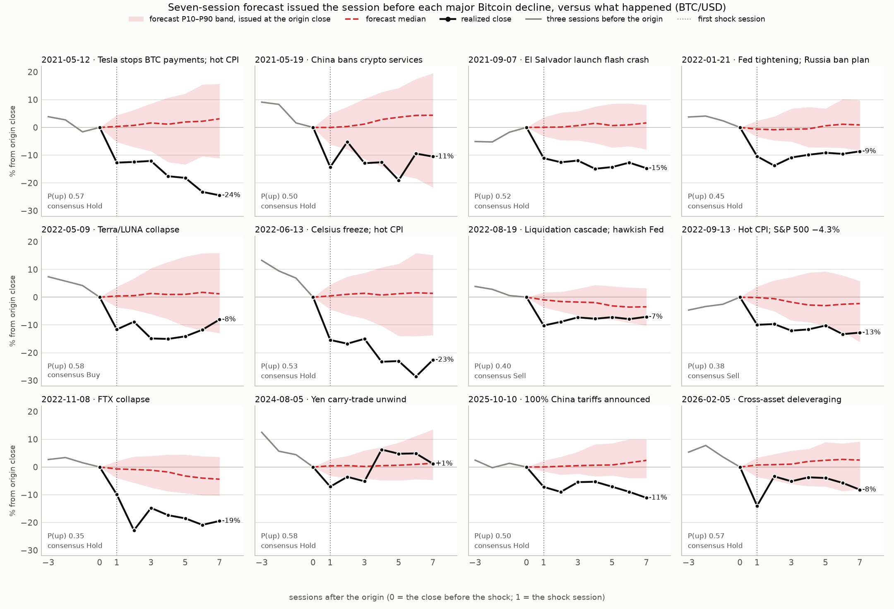
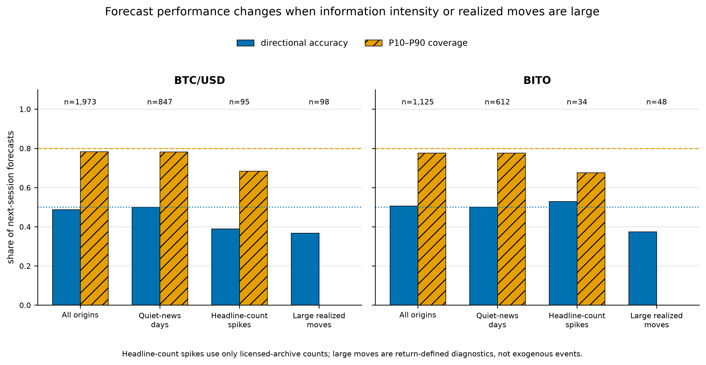
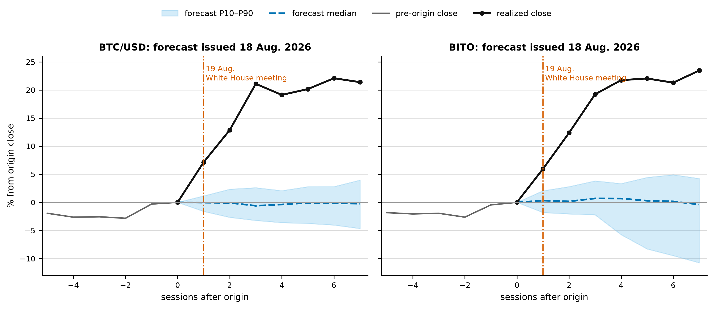

# finance-signal — what a deployed Bitcoin forecaster did when the news arrived

We operate a live "AI market signal" service. This repository is our own audit
of it: **1,973 BTC/USD and 1,125 BITO next-session forecasts**, scored
point-in-time against what actually happened, with the failures shown rather
than averaged away.

## The picture

Twelve of the largest Bitcoin declines on record. In every panel the shaded
area is the P10–P90 band the model published at the close *before* the drop,
the dashed line is its median, and the black line is what happened.



- Mean probability of an increase at the origin: **0.49**. Consensus was *Sell*
  in **2 of 12**.
- The realized next-session close fell **below P10 in 12 of 12**.
- By session 7 the realized path was back inside the band in **5 of 12**.

The twelve were chosen ex post by decline size, so this is an illustration of
where the forecast distribution fails, not an independent test. Panel labels are
descriptive context, not a causal news classification.

## The numbers

| | BTC/USD | BITO |
|---|---:|---:|
| Forecast origins | 1,973 | 1,125 |
| Directional accuracy, all origins | **48.8%** | **50.6%** |
| Nominal-80% interval coverage, all origins | 78.4% | 77.7% |
| Directional accuracy on headline-count spike days | 38.9% (n=95) | 52.9% (n=34) |
| Directional accuracy on large realized moves (\|z\| ≥ 2.5) | **36.7%** (n=98) | **37.5%** (n=48) |
| Interval coverage on large realized moves | **0.0%** | **0.0%** |



Read across a row: the intervals are calibrated on average and the direction is
a coin flip on average. Condition on the sessions that matter and both collapse.
The large-move coverage of zero is partly mechanical — a 2.5-volatility move is
being compared with an interval about 1.3 volatilities wide — and is reported
as a conditional diagnostic, not a discovery.

## The case that started it

On 18 August 2026, the evening before a White House crypto-policy meeting, the
model's next-session median for BTC was −0.05% with a P90 of +1.15%. BTC rose
**7.15%** the next session and **21.10%** over three. The deployed consensus at
the origin was *Sell*.



One event proves nothing on its own; it is why we ran the systematic audit
above. The conclusions we are willing to draw are narrow and are listed in
[Preliminary findings](#preliminary-findings).

## Where to go next

| resource | link |
|---|---|
| Working context / handover | [`research/HANDOVER.md`](research/HANDOVER.md) |
| Finance Research Letters draft | [`research/papers/frl_submission/`](research/papers/frl_submission/) |
| Preliminary arXiv paper | [`research/papers/arxiv_prefinding/paper.md`](research/papers/arxiv_prefinding/paper.md) |
| Preliminary-paper results | [`research/output/arxiv_prefinding.json`](research/output/arxiv_prefinding.json) |
| Full working paper (not submission-ready) | [`research/PAPER.md`](research/PAPER.md) |
| Engineering summary | [`research/IMPLEMENTATION_GUIDE.md`](research/IMPLEMENTATION_GUIDE.md) |
| Companion manuscripts | [`research/papers/`](research/papers/) |
| Existing data deposit (must be updated before posting) | [10.5281/zenodo.22308637](https://doi.org/10.5281/zenodo.22308637) |

## What this repository is — and is not

It contains the analysis pipeline: rolling-origin scoring, the event
studies (return shocks, headline spikes, FOMC/payroll/earnings calendars), the
sequential effectiveness tests, false-discovery control, the predictability-gap
computation, the gate experiment, the action-policy and entry-delay backtests,
and figure/table generation. Some broader-paper methods remain under revision.

It is **not** the forecasting engine being audited. That model is proprietary and
is not published here. In its place, [`model/INTERFACE.md`](model/INTERFACE.md)
specifies exactly what the audited engine must produce — two functions and one
payload schema — which means **the audit runs on any forecaster** that satisfies
that contract. Substituting your own model is a documented, supported path, and
the resulting scores are directly comparable to the paper's.

## Three ways to run it

**1. Reanalyse archived forecast scores (no engine).**
The narrow preprint starts from `forecasts_btc.csv` and `forecasts_bito.csv`.
Those rows can be rescored without the engine, but forecast generation itself
cannot be reproduced independently. A rights-safe, updated data archive is
required before public posting.

**2. Audit your own forecaster.** Implement `run_simulation` and
`build_forecast` per [`model/INTERFACE.md`](model/INTERFACE.md) and run the full
pipeline from step 1.

**3. Rebuild licensed inputs.** Raw price bars and news text are not
redistributed. The manifest records hashes and provenance, but the public
repository does not currently contain a complete retrieval utility.

```bash
uv venv .venv --python 3.12
uv pip install --python .venv/bin/python -r research/requirements-publish.txt
MPLCONFIGDIR=/tmp/mplconfig .venv/bin/python research/arxiv_prefinding.py
.venv/bin/python research/build_arxiv_prefinding.py
# Requires Tectonic on PATH:
.venv/bin/python research/build_frl_submission.py
```

## Preliminary findings

- Next-session directional accuracy is **48.8% for BTC/USD** and **50.6% for
  BITO**, with marginal nominal-80% coverage of 78.4% and 77.7%.
- On outcome-defined large-move sessions, accuracy falls to **36.7%** and
  **37.5%**, and all P10-P90 intervals miss. The coverage result is partly
  mechanical and is reported only as a conditional diagnostic.
- Headline-count spikes increase standardized forecast error for both assets.
  Directional degradation appears for BTC but not BITO, so counts alone are not
  a reliable news gate.
- The paper does **not** measure human behavior. It motivates prospective work
  on which news changes behavior and how those responses propagate into prices.

## Layout

```
model/            interface specification and stubs (engine not published)
research/         analysis pipeline, paper, guide, manuscripts
  output/         figures and small result files; the full set is on Zenodo
  papers/         preliminary preprint and legacy journal drafts
tests/            regression tests for statistical helpers
```

## Citing

> Kim, K., Kim, K., & Ahn, D. (2026). *When information breaks the historical
> pattern: Preliminary evidence from a deployed Bitcoin forecaster.* Preprint.

## Licence

Code in this repository: **Apache License 2.0** (see [`LICENSE`](LICENSE)).
The licensed market data and news text consumed by the study are not covered by
that licence and are not included in the current working tree. Public catalogue
outputs retain counts and hashes rather than headline text. The existing Zenodo
version and prior Git history require a separate rights review before release.

## Disclosure

The authors operate the forecasting service audited here. The deployed model was
not changed during the study. The analysis was organized after the August 2026
case and was not preregistered. Archived score rows can be reanalysed by third
parties, but the proprietary forecasts cannot be regenerated independently.
Nothing in this repository is investment advice.
