# When the News Arrives: Calibration Failure of a Deployed Price-Pattern Forecaster Around Information Shocks in Crypto, Index and Single-Stock Markets

**Working paper — draft v1.0 (2026-09-04).** Target: applied mathematics / quantitative finance venue (e.g. *Quantitative Finance*, *Journal of Forecasting*, *Applied Mathematical Finance*, or *Frontiers in Applied Mathematics and Statistics*).

*Kibaek Kim, Kiok Kim, Danielle Ahn — dotori.ai*

Code and data pipeline: `research/` in the `signal` repository (see Appendix A).

---

## Abstract

AI market signal products targeting retail investors increasingly offer multi-day directional forecasts. This study audits one such product: a seven-session historical-analog forecaster that has been issuing live, unchangeable daily signals on signal.dotori.ai since 2026-01-02, applied to three asset types — a Bitcoin ETF pair (BITO/BITI) and BTC/USD spot, the S&P 500 pair (SPXL/SPXS) and SPY, and 50 S&P 500 single stocks. Using the unchanged production code, every forecast that the model could have generated from the price archives was reconstructed point-in-time (about 1.49 million scored forecast–horizon pairs; for the crypto instruments, 1,125 origins for BITO and 1,973 for BTC/USD spot between 2022 and 2026), and the seven-horizon predictive distributions were evaluated against realized outcomes. For the crypto instruments, directional accuracy is 46–51% at every horizon and never significantly exceeds 50%, while nominal-80% prediction intervals cover 78–82% of outcomes — the model is *interval-calibrated but directionally uninformative in calm conditions*. The band's coverage is matched by a naive $\pm1.28\sigma\sqrt{h}$ volatility band with a better interval score, so the area is calibrated but carries no information beyond recent volatility. The analysis then considers exogenous information shocks defined as (i) spikes in headline news items (crypto-tagged newswire items at least twice the trailing median, not referring to returns) and (ii) standardized return shocks with $|z|\ge 2.5$. On days with a headline spike, the next-session directional accuracy of BTC forecasts falls to 39.0% (95% CI 29.8–49.0, $p=0.04$ compared to 50%), the standardized forecast surprise increases by about one third (Mann–Whitney $p=0.02$), and interval coverage decreases by 10 percentage points; forecasts issued the day before a shock show 0% coverage and an average absolute surprise of 3.6 band-$\sigma$. After a shock, prices continue in the direction of the shock for a week (BTC: +2.98% sign-adjusted over seven sessions, $t=3.06$, $p=0.003$, 98 events), yet the model’s seven-vote consensus agrees with the shock direction in only 6–10% of cases and takes a median of five to six sessions to reach agreement. A walk-forward, cost-adjusted rule shows that continuation can only be taken advantage of in Bitcoin and only if action is taken within one session (+2.3% net per event at 5 bp, 64% of events), while attempts to follow index or single-stock movements result in losses when costs are taken into account. The 2026-08-19 White House crypto summit, during which Bitcoin rose by 21% over three sessions (the largest short liquidation in its history), is examined as a case study: on 2026-08-18 the model advised a $-100\%$ (fully inverse) tactical position, and its seven-session P90 path reached a peak of +3.8%. The analysis shows that the 60–65% accuracy figures remembered from the product’s 50-origin evaluator are consistent with sampling noise (the standard deviation is approximately 0.06–0.07 per reading; at least one of the seven horizons reached 60% or above on 14% of days in 2026). Formal sequential tests confirm this: no horizon passes the Pesaran–Timmermann directional test, the Brier score is significantly *worse* than the constant $\tfrac12$ forecast at almost every horizon (HAC $t$ = 1.7–4.9), and the cumulative log Bayes factor against a fair coin is negative throughout ($-9$ to $-78$ nats, below zero 89–100% of the time). When the protocol is extended to the deployed S&P 500 pair (SPXL/SPXS), SPY and 50 individual stocks (2,584–4,097 origins each; 204,129 next-session stock forecasts), the *same* engine performs *differently* depending on the asset type: index shocks are two-thirds downward, revert ($-0.5$ to $-1.4\%$ over seven sessions) and reduce the forecaster’s accuracy from 0.60–0.62 to 0.34–0.36 within the shock period, whereas single-stock shocks are idiosyncratic own-news jumps (headline spikes for the individual ticker triple the shock probability) on which the forecaster is no better or worse than during calm periods; at seven sessions the simple "always up" rule outperforms the forecaster on all eight instruments. Simulations of acting on the published schedule on a daily, weekly, or monthly basis show no dominant strategy—the rankings vary from instrument to instrument and over time—and the committed weekly schedule differs from daily re-forecasting by at least 25 exposure points on 66–75% of sessions. A fully exogenous test based on calendar events confirms the mechanism: on earnings days (known years in advance) the stocks’ nominal-80% bands cover 25–27% of the outcomes and forecast surprise is 3–4 times larger ($p<10^{-5}$), on FOMC days SPY accuracy drops to 0.40 ($p=0.016$), and crypto is not affected by FOMC days — the forecaster has no event calendar of any kind; when the 50 stocks are pooled the Pesaran–Timmermann statistic is 3.08, indicating a real but economically negligible 0.3-point directional dependence, while the Brier score is worse than that of a coin for 98% of the stocks. A constructive test concludes the analysis: a causal, event-conditional gate estimated in a walk-forward manner improves the interval score on earnings sessions by 16% across the 50 stocks (coverage rises from 0.49 to 0.68, confidence interval does not include zero) and after crypto shocks by 7–17%, while the same rule has a negative effect on the stocks and the index on calendar days—the choice of gate depends on the type of event. At the scale of weeks to months, Bitcoin's decline legs of 20–60% draw only about half of their fall from shock sessions, and the model's state inside bear legs is indistinguishable from its state inside bull legs on every asset type — holding its own exposure captured two-thirds to four-fifths of each leg's loss — which argues for a regime layer above the seven-session forecaster. Under Benjamini–Hochberg control over all 228 reported tests, no directional-skill test survives, although distributional failures remain. The findings support the use of type-specific model families rather than a single shared indicator-voter set. The central thesis is expressed as a bound: for a price-conditioned forecaster, directional accuracy is bounded above by the frequency and sign-unpredictability of information arrivals and below by the skill observed during calm periods; in this study, 3–5% of sessions account for 28–37% of return variance, accuracy during calm periods is at chance level, and the returns that the product appears to capture are due to exposure, not prediction. The results indicate that human reaction to news represents an unmodelled state process — a jump followed by a behavioural response kernel — and a research programme in mathematics and neuroscience is proposed to measure this kernel so that it can be incorporated into forecasting models rather than remaining as unexplained error.

**Keywords:** forecast calibration; event study; historical analogs; nearest-neighbour forecasting; Bitcoin; news shocks; post-announcement drift; behavioral finance; neuroeconomics; proper scoring rules.

---

## 1. Introduction

Forecasting models based on price patterns—such as technical-indicator ensembles, nearest-neighbour (“analog”) predictors, and small supervised classifiers—take into account only the historical course of the price itself. The assumption that underlies these models is that the state variables important for the next few sessions are determined by that historical course. Exogenous information (a policy announcement, a regulatory decision, an executive statement) violates this assumption: the information arrives as a jump that no price feature anticipates, and the market’s *response* to it is produced by human agents whose behavior (attention, herding, forced liquidation, delayed reaction) is not in the model’s state space either.

This paper asks a narrow, measurable question about one such model that is actually deployed: **how does the quality of its seven-session predictive distribution change on and around days when exogenous news arrives, and how do humans trade after those days relative to what the model recommends?** We deliberately evaluate the production code rather than a re-implementation, and we use the model’s own frozen live signals for 2026 so that no hindsight enters the reproduction.

Three features distinguish the design from a typical backtest report:

1. **Exhaustive, point-in-time evaluation.** Every origin between the warm-up period and the end of the archive is scored, not a 50-origin sample. The various features and analog pools are calculated based on the data observed at or before the origin; the code path used is the one that publishes live.

2. **Two independent event definitions.** Return-based shocks ($|z|\ge 2.5$) are the natural definition but partially tautological for interval coverage, since a $2.5\sigma$ move lies outside a $\pm 1.3\sigma$ band by construction. For this reason we also make use of a definition which is based on the number of headlines and which never examines the return.

3. **A human-behavior counterfactual.** For every shock we measure what a trader who acts *after* seeing the news (buying/selling at the shock-day close) would have earned over the next 1–7 sessions, and how many sessions the model needed to agree.

### 1.1 Related work

*Technical rules and data snooping.* Brock et al. (1992) found that moving-average and trading-range rules showed apparent predictive ability; Sullivan et al. (1999) showed that, when looking at the complete set of rules under examination, the best rule's performance is in line with chance, and Bailey et al. (2014) expressed this phenomenon as backtest overfitting. Section 4.2 is a small-scale instance: a 50-origin evaluation that displays seven horizons prints 60%+ on one of them 14% of the time. *Analog forecasting* descends from Lorenz's (1969) atmospheric analogues and Farmer and Sidorowich's (1987) local prediction of chaotic series; in finance, return predictability of any kind is fragile out of sample (Timmermann, 2018; Welch & Goyal, 2008). *Forecast evaluation* supplies our criteria: proper scoring rules (Brier, 1950; Gneiting & Raftery, 2007), comparative accuracy tests (Diebold & Mariano, 1995; Newey & West, 1987), the directional test of Pesaran and Timmermann (1992), the variance ratio of Lo and MacKinlay (1988) and false-discovery control (Benjamini & Hochberg, 1995). *News and returns.* Tetlock (2007) linked media content to price pressure; Chan (2003) documented drift after news and reversal after no-news moves; Bernard and Thomas (1989) the post-earnings-announcement drift that Section 5.5 reproduces in miniature; Hong et al. (2000) and Frazzini (2006) associate slow diffusion and under-reaction with investor behaviour; Hirshleifer et al. (2011) indicate that attention constraints affect the speed of reaction. The inefficiency of cryptocurrencies and their sensitivity to news are documented by Urquhart (2016), Corbet et al. (2019) and Liu and Tsyvinski (2021); the behavioural models of Barberis et al. (1998), Daniel et al. (1998) and Hong and Stein (1999) provide the vocabulary of under- and over-reaction that we use.

**Contributions.** Relative to this literature the paper contributes (i) an audit protocol for a *deployed* retail forecasting product with immutable live signals — exhaustive, point-in-time, on the production code; (ii) conditioning on exogenous events defined three ways (headline spikes, return shocks, public calendars) and the *sign* of the failure this reveals: a pattern model that is contrarian into news-driven moves that continue; (iii) formal sequential effectiveness tests and elementary propositions that explain why the sign is what it is; (iv) evidence that the same engine fails in three different ways on crypto, an equity index and single stocks, with a type-specific architecture derived from measured fingerprints; and (v) a simulation of how a user should act on a multi-day schedule, showing that no cadence dominates. Overall, the results are mostly negative for the forecaster and support the behavioural hypothesis, which is why the discussion in Section 8 is included.

---

## 2. Data and the deployed model

### 2.1 Price data

| Series | Source | Rows | Span | Notes |
|----------------------------------------|---------------------------------------|-----------------------|-----------------------|----------------------------------------|
| BITO, BITI (adjusted daily OHLC) | Alpaca Market Data, SIP feed | 1,220 | 2021-10-19 → 2026-08-28 | Long/inverse ETF pair used by the deployed `b04_prediction_us_coin` dataset |
| BTC/USD (daily) | Alpaca crypto | 2,068 | 2021-01-01 → 2026-08-30 | 24/7 calendar days |
| SPXL, SPXS, SPY, QQQ, TLT, GLD (adjusted daily) | Alpaca, SIP | 2,679 each (SPXS 2,346) | 2016-01-04 → 2026-08-28 | deployed `b01_prediction_us_snp` pair; index/bond/commodity comparators |
| AAPL, MSFT, TSLA, NVDA (adjusted daily, splits) | Yahoo snapshot saved in `research/output` | 4,070–4,192 | 2010-01-04 → 2026-09-02 | deployed `s01`–`s04` datasets |
| 46 further S&P 500 stocks (adjusted daily, splits) + earnings dates | Yahoo snapshot | 3,593–4,192 each | 2010/2012 → 2026-09-02 | deployed `s00` datasets (Section 5.7) |
| Newswire items | Alpaca News (Benzinga) | 7,374 | 2024-02-01 → 2026-08-28 | Crypto-tagged subset used for news intensity |
| Published live signals (b01, b04, s01–s04) | signal.dotori.ai public API | 168 each | 2026-01-02 → 2026-09-02 | Immutable; frozen cache (stocks live from 2026-07-30) |

The Alpaca archive contains two entries for each (symbol, day) combination—those for IEX and for the consolidated SIP—and we retain the row with the higher volume (SIP). Adjusted prices are used for indicators, matching production (`auto_adjust=True` in the deployed fetcher).

### 2.2 The deployed signal engine (3-day classifier)

The production engine (in `model/strategy.py::run_simulation`) computes approximately 40 binary technical indicator signals every day and, each day, selects the seven indicators which have the highest hit rate when compared to the direction three days ahead, based on a 10-day look-back period that ends three sessions prior to the decision date (in this way making sure that all the labels used have already been realised). A weighted vote leads to a signal $S_t\in\{-1,0,+1\}$ (Short/Hold/Long). In the case of BITO the Short position involves the inverse ETF BITI and the signals which have been made live from 2026-01-01 are kept in a cache and are never recomputed. Signals that have been published live since 2026-01-01 are stored in a cache and are never recomputed.

### 2.3 The seven-session forecast (`model/forecast.py`, version `historical_analog_v3_consensus`)

At origin $t$ the model forms a feature vector
$$x_t=\big(r_t,\;m^{(5)}_t,\;m^{(20)}_t,\;\tau_t,\;\sigma^{(20)}_t,\;\rho_t,\;\pi_t\big),$$
(one-day return, 5- and 20-day momentum, price/20-day-mean $-1$, 20-day return SD, sector-rotation score, 10-day mean of the 3-day signal). For each horizon $h\in\{1,\dots,7\}$ it takes the trailing 750 candidate origins $i$ whose outcome $R_{i,h}=C_{i+h}/C_i-1$ is already observed, rescales each outcome by $\min(\max(\sigma_t/\sigma_i,0.5),2)$ to today's volatility regime, and selects the $K=60$ nearest analogs under the standardized Euclidean distance
$$d(x_t,x_i)=\Big(\tfrac{1}{7}\sum_j \big((x_{t,j}-x_{i,j})/s_j\big)^2\Big)^{1/2}.$$
The empirical distribution of the 60 rescaled outcomes gives $\hat q_{10},\hat q_{50},\hat q_{90}$, $\hat p_h=\hat P(R>0)$, a per-session probability of an up move, and a Buy/Sell/Hold vote per horizon (Buy if $\hat q^{sess}_{50}>0$ and $\hat p^{sess}\ge0.55$; Sell symmetrically). A consensus of $\ge 6$ concordant votes is "confirmed" (full move to the target exposure), exactly 5 is a "warning" (half move). There is also a separate schedule which transforms the score $0.45(2\hat p_h-1)+0.35\,\hat q_{50}/\text{risk}+0.20\,\pi_t$ into a tactical exposure path restricted to the interval $[-100\%,100\%]$ for inverse-ETF datasets.

### 2.4 Offline reproduction and its fidelity

We reconstructed the production `detailed` frame from the Alpaca archive using the deployed `run_simulation`, keeping the 168 published 2026 signals fixed in exactly the same way as the live service does. To evaluate how accurate the *unfrozen* engine is, we ran it without freezing and then compared the results to the published records for the 165 overlapping days: the signal agreement was 76.4% (on a monthly basis this is 70/95/36/71/85/91/91/75%); the adjusted-close discrepancy relative to the median of the published series was 0.004%, the highest being 0.20%. The reasons for the discrepancies are (a) the different adjustment procedures between Yahoo and Alpaca and (b) the sector-rotation attention feature, which includes eleven sector ETFs that we do not archive and which is set to its neutral value (0) when the system is offline. Because our study uses the *frozen* frame, all of the 2026 results exactly match the signals that the public saw; the pre-2026 signals are the engine’s own walk-forward outputs, as in production (and these generate the pre-live rows). The rotation feature has a neutral effect in all of our analog distance measurements; this is a known deviation from production and is the main factor preventing an exact replication of the production forecasts. For the other deployed datasets, the agreement when the engine is unfrozen is 84.2% for the S&P pair (over 165 days; median close gap 0.001%) and 93 to 100% for the four stocks (AAPL and NVDA at 100%, MSFT at 94%, TSLA at 93%; with regard to the 25 live rows since 2026-07-30: 100/100/100/76%). The high level of agreement among the stocks is rather uncomfortable because the cash-mode 200-day trend filter results in "Long" being selected for 90 to 93% of all sessions and for each of the 168 published 2026 rows for both AAPL and NVDA, so there is very little for the indicator voters to disagree about.

---

## 3. Methods

### 3.1 Rolling-origin protocol

For each origin position $t$ (from the 60th row to the penultimate row) we call `build_forecast` on the frame truncated at $t$ (this slice is the no-look-ahead guarantee; the same construction is used by the model's unit test `test_future_rows_cannot_change_point_in_time_forecast`). Realized outcomes are positional: $R_{t,h}=C_{t+h}/C_t-1$ and the session return $r_{t+h}=C_{t+h}/C_{t+h-1}-1$. (In the production payload the crypto-flagged datasets are labelled with calendar dates even though the instrument in question is an exchange-traded ETF; we calculate the returns on a positional basis, since that is exactly what the analogous construction does, and mention the defect relating to the date labelling in Appendix B.)

### 3.2 Scoring rules

For origin $t$ and horizon $h$:

- **Direction hit** $H_{t,h}=\mathbf 1\{\hat p_{t,h}\ge 0.5\}=\mathbf 1\{R_{t,h}>0\}$ (the evaluator’s convention).

- **Brier score** $(\hat p_{t,h}-\mathbf 1\{R_{t,h}>0\})^2$ (Brier, 1950), a strictly proper score for the probability.

- **Interval coverage** $\mathbf 1\{\hat q_{10}\le R_{t,h}\le \hat q_{90}\}$, nominal 0.80.

- **Standardized surprise** $s_{t,h}=(R_{t,h}-\hat q_{50})\big/\big((\hat q_{90}-\hat q_{10})/2.5631\big)$, which expresses the realized outcome in units of the forecast's own dispersion (for a Gaussian band the 10–90 width is $2\times1.2816\sigma$). $|s|>1.28$ means "outside the band".

- **Base rate** $\bar u_h=\text{mean}\,\mathbf 1\{R_{t,h}>0\}$, so that accuracy can be compared with “always up”.

### 3.3 Event definitions (fixed before scoring)

- **Return shock (z-shock).** $z_T=r_T/\hat\sigma^{(20)}_{T-1}$ with the trailing SD computed through $T-1$; a shock is $|z_T|\ge 2.5$. Sensitivity at 2.0, 3.0, 3.5 is reported.

- **Headline spike.** $N_T$ = number of Benzinga items on day $T$ tagged BTCUSD/BITO/IBIT/BITI/MSTR/COIN or matching *bitcoin|crypto|btc|stablecoin|digital asset*; weekend items are attributed to the next session. The intensity ratio is given by $\nu_T=(N_T+1)/(\tilde N^{(30)}_{T-1}+1)$, where $\tilde N^{(30)}$ is the median of the figures from the previous 30 days; a spike is identified when $\nu_T\ge 2$ occurs at least twice. Coverage began on 2024-02-01.

- **Three-day episode.** $|C_T/C_{T-3}-1|\ge 10\%$ (used only descriptively).

A “shock window” is any $(t,h)$ pair whose target span $(t,t+h]$ contains a z-shock day.

### 3.4 Human-behavior counterfactual and model latency

For each z-shock day $T$ with direction $D_T=\text{sign}(r_T)$ we record the *sign-adjusted continuation* $D_T\,(C_{T+k}/C_T-1)$ for $k\in\{1,2,3,5,7\}$: the return to a trader who, having seen the news and the move, takes a position in the shock direction at the close of $T$. We record whether the 3-day signal and the seven-vote consensus were already aligned with $D_T$ at $T-1$ and, if not, the number of sessions after $T$ until they first agree (censored at 15).

### 3.5 Inference

We apply Wilson score intervals and exact binomial tests to the hit rates; in the case of the differences between the overlapping-horizon groups we use a moving-block bootstrap (with a block length of 7 and 4,000 draws); Mann–Whitney U tests are applied to the surprise distributions; Spearman rank correlation is used to look at monotone dependence on news intensity; one-sample t tests are carried out for the continuation returns. Rather than merely reporting the best horizon we report all the horizons and address the problem of multiplicity in Section 7.

### 3.6 Pre-specified rules and multiplicity

The event definitions (Section 3.3), the scoring rules (3.2), the horizons, the shock threshold, the news-intensity threshold and the policy cadences (6.4) were all set prior to any forecasting being scored, and no rule was altered after the results had been observed; sensitivity with respect to the shock threshold is given (Section 5.1). Since the study includes eight instruments × seven horizons × several conditioning splits, we classify each p-value reported into pre-specified groups (direction versus ½; Pesaran–Timmermann skill; Brier versus the coin; shock versus calm; pre-event direction; post-shock continuation; headline-spike direction and surprise; scheduled-event direction and surprise) and apply the Benjamini–Hochberg false-discovery control both within each group and jointly across all the groups (Section 4.4). For horizons $h>1$ the Pesaran–Timmermann statistic that enters the group is the average of the $h$ non-overlapping subsequences, not the overlap-inflated full-sample value.

---

## 4. Results I — unconditional calibration and the "65%" question

### 4.1 Directional accuracy is not distinguishable from 50%

**Table 1. Rolling-origin calibration by horizon, all origins.** (Fig. 3)

| | BITO — hit | 95% CI | base $\bar u$ | Brier | cover. | | BTC — hit | 95% CI | base $\bar u$ | Brier | cover. |
|----|-----|---------|----|-----|------|----|-----|---------|----|-----|------|
| $h=1$ | 0.506 | .477–.535 | .487 | .254 | .777 | | 0.488 | .466–.510 | .495 | .255 | .784 |
| $h=2$ | 0.471 | .443–.501 | .496 | .260 | .787 | | 0.500 | .478–.522 | .512 | .257 | .788 |
| $h=3$ | 0.460 | .431–.489 | .510 | .264 | .795 | | 0.489 | .467–.511 | .519 | .259 | .794 |
| $h=4$ | 0.479 | .450–.509 | .512 | .262 | .800 | | 0.489 | .467–.511 | .511 | .261 | .796 |
| $h=5$ | 0.481 | .452–.510 | .518 | .264 | .810 | | 0.476 | .454–.498 | .514 | .264 | .796 |
| $h=6$ | 0.495 | .466–.525 | .513 | .263 | .816 | | 0.483 | .461–.505 | .514 | .266 | .794 |
| $h=7$ | 0.479 | .450–.508 | .519 | .268 | .810 | | 0.467 | .445–.489 | .510 | .269 | .790 |

The origins are $n=1{,}119$ to $1{,}125$ (BITO, 4 March 2022 to 27 August 2026) and $1{,}967$ to $1{,}973$ (BTC, 5 April 2021 to 29 August 2026). Both horizons are considerably *below* 0.5 (BITO with $h=3$ and $p=0.007$; BTC with $h=7$ and $p=0.004$), while none of them is significantly above this level. The Brier scores, which vary between 0.25 and 0.27, are either at or worse than those obtained with the fixed forecast $\hat p=0.5$ (which has a Brier score of 0.25). If we consider only the year 2026 (the live period), the scores are BITO 0.45 to 0.52 and BTC 0.41 to 0.50 (for BTC with $h=7$: 0.413, $p=0.009$). The proportion of votes given per session (taking into account only the Buy and Sell options) is 49 to 52%.

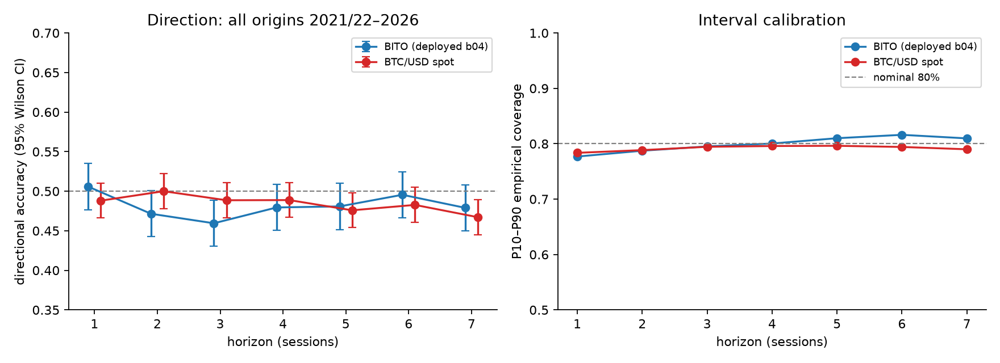

By contrast, **interval calibration is good**: empirical 10–90 coverage is 0.78–0.82 against nominal 0.80 at every horizon, and the mean absolute standardized surprise is 0.77–0.89 (≈ the 0.80 expected for a well-calibrated Gaussian band). The model thus knows *how wide* the distribution is under normal conditions but does not know *which side* the outcome will fall on—this is a typical example of a 'calibrated but not sharp' forecaster.

**The area against a volatility formula.** Calibration of the band is real, but it is not information. Table 22 compares the model's 10–90 band with a naive band, $\pm1.2816\,\hat\sigma^{(20)}\sqrt{h}$ around the origin close, on the same origins. The two have the same coverage, similar width, and the naive band has the better Winkler score at every horizon. Misses are symmetric but clustered: 48% of next-session misses arrive in runs of two or more against 39% under independence, and 63% of seven-session misses fall in shock windows that make up 28% of sessions. Figure 19 draws both bands against the realized close over the last fifteen months: the area is right about four sessions in five, so is the formula, and the misses sit on the news. The area is a usable risk envelope; the median and direction drawn inside it are what fail.

**Table 22. The model's 10–90 band against a naive volatility band, BTC/USD, all origins.** Naive band: $\pm1.2816\,\hat\sigma^{(20)}_t\sqrt{h}$ around the origin close. Winkler score ($\alpha=0.2$) in return points, lower is better; "shock windows" are target spans containing a $|z|\ge2.5$ session.

| horizon | coverage model / naive | coverage on calm windows | mean width % model / naive | Winkler model / naive | misses below | share of misses in shock windows (share of sessions) |
|---|---|---|---|---|---|---|
| 1 | 0.784 / 0.817 | 0.825 / 0.860 | 6.4 / 6.9 | 10.68 / 10.59 | 48% | 23% (5%) |
| 3 | 0.795 / 0.814 | 0.877 / 0.903 | 12.0 / 11.9 | 18.58 / 18.26 | 49% | 48% (13%) |
| 7 | 0.790 / 0.783 | 0.894 / 0.914 | 19.7 / 18.2 | 30.95 / 29.37 | 50% | 63% (28%) |


### 4.2 Where a 60–65% reading comes from

The evaluator (`evaluate_forecast.py`) normally uses 50 origins, with these being selected once every five sessions. Re-sampling that design over the exhaustive results (2,000 random 50-origin windows) gives an $h=1$ accuracy of mean 0.514, SD 0.060 for BITO and mean 0.498, SD 0.065 for BTC; 14% (BITO) and 10% (BTC) of such windows print $\ge 0.60$, and 0.7–1.4% print $\ge 0.65$ (maximum observed 0.66 and 0.70). Recomputing what the evaluator would have displayed on each day of 2026 for BITO, the $h=5$ reading ranged 0.44–0.58 and never reached 0.60; the single best reading of any horizon was $h=4$ at 0.62 on 2026-06-26, and at least one of the seven horizons read $\ge0.60$ on 14% of days (Fig. 8). The remembered figure of "61–63% on day 5" is therefore very probably a noisy reading based on a different dataset or the result of a look-elsewhere effect across the seven horizons; with $n=50$ the 95% Wilson interval around 0.62 extends from 0.48 to 0.74.

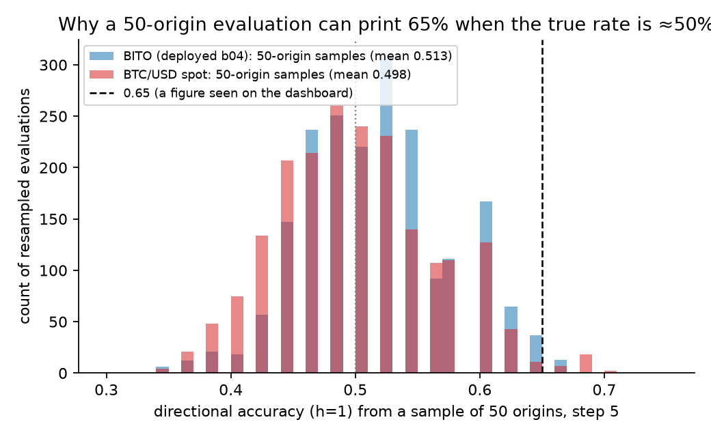

The 3-day published signal (covering 2026 and consisting of 133 active Long/Short days) has a next-day directional hit rate of 0.534 ($p=0.49$), this ranging from 0.67 in February to 0.385 in July; the +77% cumulative return of the strategy against a $-13.6\%$ buy-and-hold result is due to exposure asymmetry (from the inverse position during the spring drawdown) and not because of directional accuracy.

### 4.3 Formal tests of predictive effectiveness in series

The three standard sequential criteria are applied in order to establish what is meant by "effectiveness in series", each of the criteria being computed over the whole original sequence (see Table 2). (i) The **Pesaran–Timmermann (1992) statistic** is employed to determine whether the predicted and actual directions are independent, taking into account possibly unequal base rates; it has an asymptotic distribution of $N(0,1)$, and any values above 1.645 signify a degree of skill at the 5% one-sided level. Since for $h>1$ there is overlap among consecutive outcomes, we also calculate the statistic for the $h$ non-overlapping subsequences (that is, every $h$-th origin) and give the mean and the range of these. (ii) A **Diebold–Mariano-type test** is carried out on the Brier loss against the constant forecast $\hat p\equiv\tfrac12$ (loss 0.25): $d_t=(\hat p_t-y_t)^2-0.25$, using the Newey–West long-run variance (Bartlett kernel, lag $h$); a positive mean indicates that the model is performing worse than the coin. (iii) The **cumulative log Bayes factor** $\Lambda_n=\sum_{t\le n}\big[y_t\log\hat p_t+(1-y_t)\log(1-\hat p_t)+\log 2\big]$ (with the probabilities clipped to $[0.02,0.98]$) is used, and under calibration the expected value at each step is equal to the Kullback–Leibler divergence $\mathrm{KL}(\hat p_t\,\|\,\tfrac12)\ge0$ — consequently, an effective probabilistic forecaster produces a submartingale that tends to increase, and the even-odds Kelly bet of fraction $2\hat p_t-1$ has a positive expected log growth. We provide $\Lambda_n$, the proportion of the sequence that is below zero, and the realized Kelly growth per session.

**Table 2. Effectiveness in series, all origins.** PT = Pesaran–Timmermann statistic (all origins / mean over non-overlapping subsequences [min, max]); NW $t$ = HAC $t$ of mean Brier excess over 0.25; $\Lambda_n$ in nats; Kelly in basis points of log wealth per session.

| $h$ | BITO PT all | PT non-overlap | Brier−0.25 (NW $t$) | $\Lambda_n$ | Kelly bps | BTC PT all | PT non-overlap | Brier−0.25 (NW $t$) | $\Lambda_n$ | Kelly bps |
|----|-----|--------------------|--------------|-----|-----|-----|--------------------|--------------|-----|-----|
| 1 | +0.13 | +0.13 | +0.0040 (1.72) | −9.3 | −82 | −1.09 | −1.09 | +0.0050 (3.27) | −20.3 | −103 |
| 2 | −1.98 | −1.42 [−1.46, −1.38] | +0.0096 (3.81) | −22.2 | −198 | +0.01 | −0.01 [−0.39, +0.38] | +0.0072 (3.67) | −29.6 | −150 |
| 3 | −2.65 | −1.54 [−2.25, −1.09] | +0.0136 (4.50) | −31.7 | −282 | −1.12 | −0.63 [−1.68, +0.27] | +0.0089 (3.93) | −36.3 | −184 |
| 4 | −1.25 | −0.62 [−1.36, +0.02] | +0.0115 (2.99) | −27.0 | −241 | −0.94 | −0.48 [−1.52, +0.35] | +0.0106 (3.98) | −43.3 | −220 |
| 5 | −1.08 | −0.47 [−1.78, +0.59] | +0.0140 (3.41) | −33.0 | −295 | −2.17 | −0.98 [−1.72, −0.65] | +0.0137 (4.24) | −56.4 | −286 |
| 6 | −0.07 | −0.04 [−1.08, +1.30] | +0.0128 (2.56) | −30.9 | −276 | −1.62 | −0.67 [−1.43, +0.20] | +0.0161 (4.46) | −66.6 | −338 |
| 7 | −1.17 | −0.45 [−1.18, +0.36] | +0.0181 (3.23) | −43.6 | −390 | −2.91 | −1.10 [−2.33, +1.37] | +0.0190 (4.92) | −78.1 | −397 |

On neither instrument is there a horizon at which the value reaches PT $>1.645$ in the entire sequence, and this is also true for no non-overlapping subsequence (the highest value being 1.37). The Brier excess over the coin is positive at every horizon and significant at $h\ge2$ for BITO and at every $h$ for BTC: the model is not merely uninformative but *confidently miscalibrated.* $\Lambda_n$ is negative at every horizon, spends 89–100% of the sequence below zero, and loses 0.012–0.057 bits per forecast; betting the stated probabilities at even odds would have lost 82–397 bp of log wealth per session. Conditionally at $h=1$ (Table 3), calm sessions are indistinguishable from the coin (PT +0.47 / −0.54) while shock sessions show significant **anti-skill** for BTC (PT −2.49, one-sided $p=0.994$; Kelly −390 bp per session) and headline-spike days PT −1.81; this is the empirical content of Proposition 2 below.

**Table 3. $h=1$ effectiveness by regime.**

| subset | BITO $n$ | PT | Brier NW $t$ | Kelly bps | BTC $n$ | PT | Brier NW $t$ | Kelly bps |
|----------------------------|-----|-----|-----|-----|-----|-----|-----|-----|
| calm sessions | 1,077 | +0.47 | 1.25 | −61 | 1,875 | −0.54 | 2.75 | −88 |
| shock sessions ($\lvert z\rvert\ge2.5$) | 48 | −1.71 | 2.25 | −572 | 98 | **−2.49** | 2.69 | −390 |
| quiet news days | 612 | −0.24 | 0.62 | −39 | 847 | −0.03 | 2.43 | −105 |
| headline-spike days | 34 | +1.22 | 1.79 | −422 | 95 | −1.81 | 1.94 | −288 |
| live period 2026 | 164 | −1.40 | 2.08 | −252 | 241 | −1.07 | 2.34 | −148 |

### 4.4 What survives false-discovery control

Table 13 applies Benjamini–Hochberg control to all of the p-values provided in the paper (including 228 tests spread over ten pre-determined families; see Section 3.6). The pattern is the paper's argument in one table. **No Pesaran–Timmermann skill test survives at any horizon on any instrument (0 of 56, within-family or pooled).** The *distributional* findings survive: the Brier score is worse than the constant forecast on 22 of 56 instrument–horizon pairs; the shock-window accuracy deficit survives on 5 of 8 instruments (BITO, SPXL, SPY, AAPL, MSFT); forecast surprise is larger on scheduled-event days in 10 of 16 instrument–calendar pairs (all four earnings sets, payrolls on SPY and SPXL, and BTC payrolls) and on headline-spike days for both crypto instruments. Of the 34 results that are significantly above ½ and that survive, all relate to index or single-stock horizons where the always-up base rate is higher than the model’s accuracy — that is, to base-rate inflation rather than to skill — and the two that survive *below* ½ are connected with crypto horizons. The per-event *directional* results are the paper's weakest links once multiplicity is charged: the 37% pre-shock accuracy (BTC $q$=0.09 within family, 0.035 pooled; BITO $q$=0.26), the 39% headline-spike accuracy (BTC $q$=0.08) and the FOMC-day accuracy drop on SPY ($q$=0.60) are suggestive at $q\le0.10$ or weaker and should be read as such; the BTC seven-session continuation survives ($q$=0.023). The conclusions on which the paper is based — the absence of skill, confident miscalibration, and the degradation of the predictive distribution on days with exogenous events — are the ones that remain.

**Table 13. Benjamini–Hochberg survivors at $q\le0.05$ by family (within-family / pooled across all 228 tests).**

| family | tests | survive within | survive pooled | reading |
|-----------------------------|-----|-------|----------------|----------------------------------------|
| A direction vs ½ (binomial) | 56 | 36 | 35 | 34 above ½ (index/stock drift, below base rate), 2 below ½ (crypto) |
| B Pesaran–Timmermann skill | 56 | **0** | **0** | no directional skill anywhere |
| C Brier worse than coin (HAC) | 56 | 22 | 21 | confident miscalibration |
| D shock-window vs calm hit | 8 | 5 | 5 | BITO, SPXL, SPY, AAPL, MSFT |
| E pre-event $h$=1 direction | 8 | 0 | 1 | suggestive only |
| F 7-session continuation | 8 | 1 | 1 | BTC |
| G headline-spike direction | 2 | 0 | 0 | suggestive only |
| H headline-spike surprise | 2 | 2 | 1 | BITO, BTC |
| I scheduled-event direction | 16 | 0 | 0 | none |
| J scheduled-event surprise | 16 | 10 | 9 | all earnings sets; payrolls |
| all | 228 | — | 73 (79 at $q\le0.10$) | |

---

## 5. Results II — forecasts around information shocks

### 5.1 Return-defined shocks

**Table 4. Shock windows vs calm windows (all horizons pooled).**

| | BITO shock | BITO calm | Δ (block-bootstrap 95% CI) | BTC shock | BTC calm | Δ |
|---|---|---|---|---|---|---|
| $n$ (origin×horizon) | 1,079 | 6,775 | | 2,315 | 11,475 | |
| direction hit | **0.359** | 0.501 | −0.143 (−0.196, −0.089) | 0.460 | 0.489 | −0.029 (−0.072, +0.013) |
| 10–90 coverage | 0.361 | 0.869 | −0.508 (−0.567, −0.451) | 0.393 | 0.872 | −0.480 (−0.518, −0.438) |
| mean $|s|$ | 1.97 | 0.64 | | 1.93 | 0.62 | |
| Brier | 0.288 | 0.258 | | 0.270 | 0.260 | |

The decrease in coverage is to some extent the result of mechanical factors (as mentioned in Section 1). However, the **directional** aspect of it is not: with regard to BITO, the forecasts that have a target span covering a shock are wrong 64% of the time, representing a 14-point deficit which is still significant at all thresholds from $|z|\ge2.0$ to $3.5$ (the figure for shocks within the window being 0.36–0.40 as compared with 0.49–0.51 for calm periods).

Binned by the size of the realized next-session move (Fig. 4, left), $h=1$ accuracy is flat at ≈0.50 up to $|z|<2.5$ and then falls to 0.375 (BITO, $n=48$) and 0.367 (BTC, $n=98$, $p=0.011$). **The model is systematically on the wrong side of the largest moves**, which is what one expects if analogs are drawn from mean-reverting calm regimes: after a two-day rise the nearest neighbours say "fade", and news-driven trends do not fade.

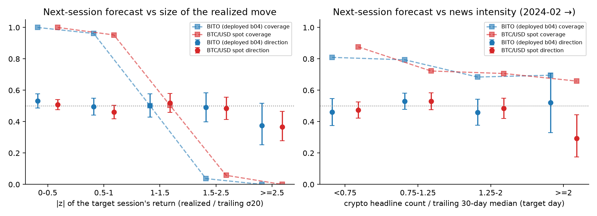

### 5.2 Headline-defined shocks (non-tautological)

**Table 5. Next-session forecasts on headline-spike days ($\nu_T\ge2$) vs quiet days, 2024-02 → 2026-08.**

| | BITO spike | BITO quiet | BTC spike | BTC quiet |
|---|---|---|---|---|
| days | 34 | 612 | 95 | 847 |
| direction hit (95% CI) | 0.529 (.37–.69) | 0.500 | **0.390 (.30–.49)**, $p=0.04$ | 0.499 |
| 10–90 coverage | 0.676 | 0.776 | 0.684 | 0.783 |
| Δ coverage (bootstrap CI) | −0.100 (−0.227, +0.013), $p=0.08$ | | −0.099 (−0.220, +0.011), $p=0.08$ | |
| mean / median $|s|$ | 1.27 / 1.05 | 0.87 / 0.71 | 1.15 / 0.78 | 0.84 / 0.62 |
| Mann–Whitney $|s|$ spike > quiet | $p=0.005$ | | $p=0.023$ | |
| mean $|r|$ (%) | 2.76 | 2.36 | 2.08 | 1.73 |
| share of days with $|z|\ge2.5$ | 8.8% | 3.3% | 11.6% | 4.1% |

The relationship between headline spikes and large returns is only weak (returns are 2.7 to 2.8 times the base rate of $|z|\ge2.5$ days, but 88 to 92% of the days on which there is a spike are *not* z-shocks), so this test is mostly independent of Section 5.1. However, on days when there are spikes the forecast surprise is much higher for both instruments, coverage falls by about 10 points, and for BTC the directional accuracy drops to 39%. Across the whole news-covered sample, Spearman correlations of $\nu_T$ with coverage are −0.11 (BITO, $p=0.004$) and −0.18 (BTC, $p<10^{-4}$), and with $|s|$ +0.15 and +0.23 ($p\le10^{-4}$); the correlation with the *direction* hit is ≈0 for both (Fig. 4, right). **News degrades the model's distribution, not just its sign: the more headlines, the further the outcome lands from the forecast median in the forecast's own units.**

On the day preceding the spike (for each of the seven horizons) the forecast *paths* were at 0.43 (BITO) and 0.45 (BTC) with coverage levels of 0.58 and 0.66, while on other days the figures were 0.50/0.81 and 0.49/0.79.

### 5.3 The forecast issued the day before a shock

**Table 6. Forecasts made at $T-1$ for the 48 (BITO) and 98 (BTC) z-shock days.**

| | BITO | BTC |
|---|---|---|
| events (up / down) | 48 (26 / 22) | 98 (55 / 43) |
| $h=1$ direction hit (Wilson 95%) | 0.375 (.25–.52), $p=0.11$ | **0.367 (.28–.47), $p=0.011$** |
| $h=1$ coverage | 0.000 | 0.000 |
| mean $|s_1|$ | 3.68 | 3.59 |
| 7-session path coverage | 0.277 | 0.300 |
| direction hits over $h=1..7$ (of 7) | 2.54 | 3.26 |
| 3-day signal already aligned at $T-1$ | 50% | 48% |
| 7-vote consensus already aligned at $T-1$ | **10.4%** | **6.1%** |

The 3-day signal agrees with the upcoming shock as often as a coin toss, while the seven-session consensus almost never does (Fig. 7).

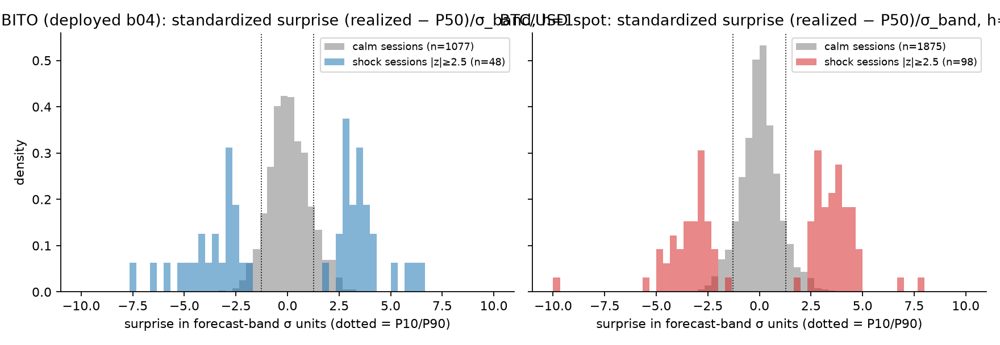

### 5.4 Other asset types: the index pair and single stocks

The service currently uses a single indicator-voter engine and one analog forecaster for cryptocurrencies, for the S&P 500 pair and for several hundred individual stocks; the only variations being the cash-mode trend/multi-horizon filters and the inverse leg. In the case of applying the same protocol to the S&P dataset that is in use (SPXL/SPXS, with the 2026 signals fixed), compared to SPY spot and the four major stocks (AAPL, MSFT, TSLA, NVDA; with the live signals from 2026-07-30 onwards held fixed), it turns out that the common engine is dealing with a different prediction problem for each of the asset types. (Fig. 9, 10)

**Table 9. Deployed forecaster by instrument.** PT = Pesaran–Timmermann at $h=1$; "shock" = target span contains a $|z|\ge2.5$ day; pre-event = forecast issued at $T-1$; latency = median sessions until the consensus agrees with the shock direction.

| instrument | type | origins | $h$=1 hit / always-up | PT | $h$=7 hit / always-up | shock hit / calm hit (Δ) | pre-event $h$=1 hit ($n$) | consensus aligned | latency |
|----------|------|-------|-----------|-----|-----------|------------------|----------|---------|-------|
| BTC/USD | crypto | 1,973 | .488 / .495 | −1.09 | .467 / .510 | **.460 / .489** (−.03) | **.367** (98) | 6% | 6 |
| BITO | crypto | 1,125 | .506 / .487 | +0.13 | .479 / .519 | **.359 / .501** (−.14) | **.375** (48) | 10% | 5 |
| SPXL | index | 2,584 | .527 / .548 | −0.90 | .594 / .615 | **.337 / .599** (−.26) | .385 (96) | 10% | **2** |
| SPY | index | 2,584 | .526 / .551 | −1.23 | .612 / .635 | **.355 / .621** (−.27) | .418 (98) | 12% | **2** |
| AAPL | stock | 4,097 | .513 / .530 | −0.10 | .565 / .586 | .507 / .556 (−.05) | .494 (170) | 15% | 4 |
| MSFT | stock | 4,097 | .518 / .523 | +1.48 | .537 / .582 | .486 / .546 (−.06) | .515 (163) | 15% | 7 |
| TSLA | stock | 3,975 | .496 / .517 | −0.80 | .514 / .541 | .508 / .513 (−.01) | .497 (171) | 11% | 4 |
| NVDA | stock | 4,097 | .506 / .529 | −1.00 | .542 / .577 | .551 / .531 (+.02) | .560 (141) | 17% | 4 |

There are three regularities. (i) **On every instrument the "always up" rule beats the forecaster at seven sessions** (e.g. SPY 0.635 vs 0.612, AAPL 0.586 vs 0.565): the index and stock accuracies of 0.54–0.61 that look like skill are base-rate inflation from positive drift, which is why the PT statistic — never above 1.48 — is the right yardstick. (ii) The **shock-window deficit is type-specific**: −26 points on the index, −14 on BITO, −3 on BTC, and −5 to +2 on single stocks. (iii) **Recovery speed is type-specific too**: the consensus re-aligns after index shocks in a median of 2 sessions but needs 4–7 on stocks and 5–6 on crypto.

**Table 10. Asset-type fingerprints** (2016 → 2026; BTC and stocks from 2016 for comparability). Continuation = sign-adjusted return after a $|z|\ge2.5$ shock; "own-news spike" uses the type's own headline profile (crypto words/tags; broad-market tags + macro words; the ticker's own tag).

| instrument | type | ann. vol % | excess kurtosis | shocks / yr | shock up-share | lag-1 autocorr | VR(5) | cont. 3d % | cont. 7d % ($t$) | shocks clustered ≤3d | $\lvert r\rvert$ spike ÷ quiet | shock share: spike vs quiet days |
|----------|---------|----|--------|------|--------|--------|-----|-----|------------|---------|-------|-------------|
| BTC/USD | crypto | 57.5 | 4.0 | 17.5 | 57% | −.041 | .97 | +1.24 | **+2.98 (3.1)** | 21% | 1.20 | 11.6% vs 4.1% |
| BITO | crypto | 54.4 | 3.6 | 10.3 | 54% | −.041 | .94 | +1.38 | +1.71 (1.0) | 31% | 1.17 | 8.8% vs 3.3% |
| SPY | index | 17.5 | **12.7** | 9.2 | **34%** | −.119 | .86 | −0.22 | −0.52 (−1.5) | 26% | 0.95 | 6.9% vs 3.6% |
| SPXL | index | 51.9 | 11.9 | 9.0 | 33% | −.097 | .88 | −0.45 | **−1.39 (−1.4)** | 25% | 0.96 | 6.9% vs 3.4% |
| QQQ | index | 22.3 | 7.4 | 8.5 | 40% | −.120 | .82 | −0.12 | −0.35 (−0.9) | 17% | 0.90 | 3.4% vs 3.6% |
| TLT | bond | 14.7 | 5.2 | 7.4 | 52% | −.020 | .85 | −0.07 | +0.38 (1.3) | 18% | 1.39 | 6.9% vs 2.9% |
| GLD | commodity | 16.5 | 6.9 | 10.4 | 54% | −.004 | .96 | +0.40 | +0.30 (0.9) | 21% | 0.90 | 3.4% vs 3.2% |
| AAPL | stock | 28.9 | 6.7 | 10.5 | 48% | −.054 | .90 | −0.45 | −0.91 (−1.9) | 14% | **1.85** | **14.9% vs 4.0%** |
| MSFT | stock | 27.5 | 8.9 | 9.7 | 53% | −.123 | .80 | −0.31 | −0.77 (−1.7) | 19% | 1.46 | 9.9% vs 3.2% |
| TSLA | stock | 58.6 | 4.3 | 10.3 | 51% | −.009 | 1.03 | +0.35 | +0.52 (0.5) | 17% | **1.91** | **14.5% vs 2.4%** |
| NVDA | stock | 49.3 | 7.9 | 9.1 | 55% | −.079 | .90 | +0.70 | +0.87 (1.0) | 9% | 1.53 | 12.0% vs 2.3% |

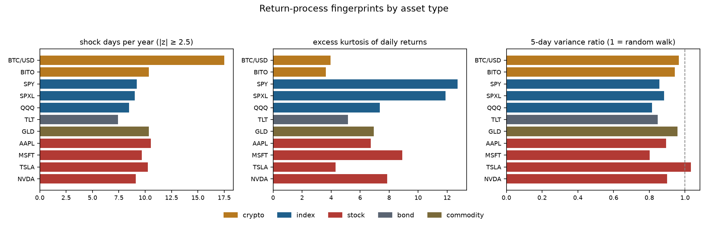

The fingerprints are not variations on one theme. *Crypto* is a near-random walk (VR 0.94–0.97) with comparatively light tails, symmetric shocks, strong clustering and **positive post-shock continuation** — the behavioral drift of Section 6 — driven by policy/headline news that is not on a calendar. *The index* has the heaviest tails (kurtosis 12–13), **two-thirds of its shocks are downward**, it mean-reverts over a week (VR 0.82–0.88, lag-1 autocorrelation −0.10 to −0.12) and **reverses after shocks**; its own-news spikes carry no excess volatility (ratio 0.95), because macro news is largely scheduled and partly priced. *Single stocks* sit between: idiosyncratic own-news jumps (an own-ticker headline spike raises $|r|$ by 1.5–1.9× and **triples to quadruples the shock probability**), heterogeneous continuation (AAPL/MSFT revert, TSLA/NVDA continue), weaker clustering. The difference between the types lies in the *speed* rather than in *sensitivity*: shock sessions account for the same proportion of return variance in stocks (30 to 37%) as they do in crypto (34 to 35%), earnings sessions move a stock by 3 to 4 times its normal range, and every recorded stock price change is an information event — but by the end of the session a stock has absorbed the news, whereas Bitcoin takes a whole week to absorb it. Four structural reasons: earnings and macro releases are *quantifiable* (analysts recompute fair value within hours) while a policy statement about a crypto bill is *argued out* over days on social platforms; the fifty stocks studied are the most heavily covered and arbitraged securities in the world, and news travels slowly only where coverage is thin (Hong et al., 2000); crypto leverage produces liquidation cascades that mechanically extend a move; and crypto news is unscheduled and clusters, whereas earnings and FOMC dates are known and pre-positioned. A voter set tuned to any one of these regimes is mis-specified for the other two: the contrarian analog behaviour that is catastrophic on clustered crypto shocks is roughly right on index reversals (hence the 2-session latency) and irrelevant on earnings jumps.

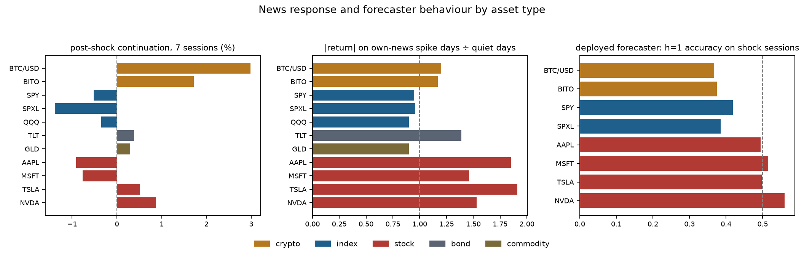

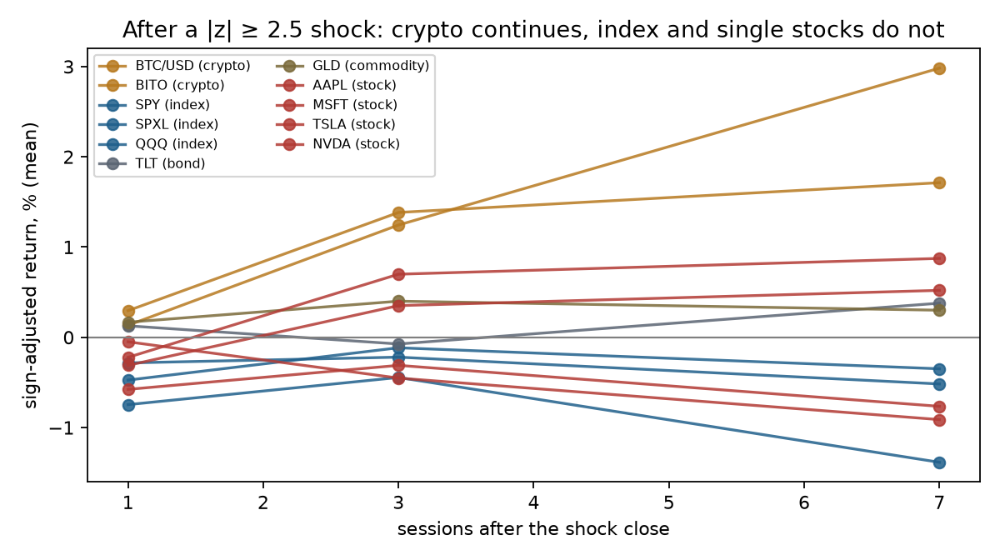

### 5.5 Fully exogenous events: FOMC decisions, payroll releases, earnings dates

Headline counts are only an approximation; return shocks are to some extent circular. Publicly available calendars do not have this feature: the dates on which the FOMC makes its decisions (from 2016 to 2026-07, 85 meetings), the dates of the Employment Situation releases (the first Friday, 123 meetings) and the quarterly earnings announcement sessions for each individual stock (63 to 65 per stock from 2010) are known in advance and do not refer to prices or to headlines. We compare the $h=1$ forecast released the day before each event with all the other forecasts (Table 12).

**Table 12. Next-session forecasts issued the day before a scheduled event vs all other days.**

| instrument | event | $n$ | hit event / other | up-rate event / other | coverage event / other | mean $\lvert s\rvert$ event / other (MWU $p$) | mean $\lvert r\rvert$ % | shock share | consensus aligned | continuation 1d / 3d / 7d (%) |
|----------|--------|----|----------------------------------------|---------|-------------|-------------------|-----------|-----------|---------|--------------------------------|
| SPY | FOMC | 83 | **0.398 / 0.530** (Δ −0.13, CI −0.20…−0.02, $p$=0.016) | .45 / .56 | 0.675 / 0.771 | 1.09 / 0.87 (0.10) | 0.93 / 0.72 | 8.4% / 3.6% | 17% | 0.0 / 0.0 / 0.0 |
| SPXL | FOMC | 83 | 0.458 / 0.530 | .43 / .55 | 0.687 / 0.772 | 1.08 / 0.87 (0.19) | 2.78 / 2.13 | 8.4% / 3.6% | 18% | 0.0 / 0.1 / 0.1 |
| SPY | payrolls | 123 | 0.569 / 0.523 | .63 / .55 | 0.675 / 0.773 | **1.08 / 0.87 (0.001)** | 0.88 / 0.71 | 4.9% / 3.7% | 27% | 0.1 / 0.0 / 0.2 |
| SPXL | payrolls | 123 | 0.569 / 0.525 | .63 / .54 | 0.683 / 0.774 | **1.09 / 0.86 (0.001)** | 2.61 / 2.13 | 4.9% / 3.7% | 19% | 0.2 / 0.0 / 0.7 |
| BITO | FOMC | 36 | 0.472 / 0.507 | .44 / .49 | 0.806 / 0.776 | 0.71 / 0.90 (0.86) | 2.15 / 2.47 | 0% / 4.4% | 17% | 0.2 / 1.3 / 1.7 |
| BTC/USD | FOMC | 43 | 0.558 / 0.486 | .54 / .49 | 0.767 / 0.784 | 0.86 / 0.85 (0.36) | 2.33 / 1.99 | 2.3% / 5.0% | 2% | −0.5 / −1.3 / −0.7 |
| BTC/USD | payrolls | 64 | 0.500 / 0.488 | .55 / .49 | 0.656 / 0.788 | 1.03 / 0.85 (0.011) | 2.59 / 1.97 | 7.8% / 4.9% | 6% | 0.2 / 0.8 / 0.0 |
| AAPL | earnings | 65 | 0.492 / 0.514 | .49 / .53 | **0.246 / 0.780** | **3.08 / 0.84 (<10⁻⁵)** | 3.88 / 1.20 | **49% / 3.4%** | 12% | **+0.57** ($p$=.007) / +0.16 / +0.28 |
| MSFT | earnings | 65 | 0.462 / 0.519 | .60 / .52 | **0.262 / 0.792** | **3.41 / 0.82 (<10⁻⁵)** | 3.90 / 1.10 | **54% / 3.2%** | 17% | +0.38 / **+0.86** ($p$=.011) / +0.53 |
| TSLA | earnings | 63 | 0.524 / 0.495 | .51 / .52 | **0.270 / 0.786** | **2.79 / 0.84 (<10⁻⁵)** | 7.54 / 2.43 | **54% / 3.5%** | 6% | +0.67 / +1.02 / +1.79 |
| NVDA | earnings | 65 | 0.600 / 0.505 (Δ +0.10, $p$=0.022) | .60 / .53 | **0.246 / 0.779** | **3.35 / 0.85 (<10⁻⁵)** | 6.39 / 1.93 | **48% / 2.7%** | 17% | +0.10 / +0.72 / +1.10 |

Three type-specific findings, none of which involves a return- or headline-defined event. **Single stocks:** on earnings sessions the forecaster's nominal-80% band covers a quarter of outcomes, surprise is 3–4 band-σ (against 0.8 otherwise), and half of all earnings sessions are $|z|\ge2.5$ shocks — the analog model issues calm-regime bands into an event that has been on the calendar for months. Direction is at the base rate (no anti-skill: earnings surprises are not autocorrelated the way policy news is), and a modest post-earnings drift appears (AAPL +0.57% next session, MSFT +0.86% over three), the pattern of Bernard and Thomas (1989). **Index:** FOMC days cut SPY's next-session accuracy from 0.53 to 0.40 and coverage by 10 points; FOMC days skew downward (45% up vs 56%), so the loss is partly a base-rate shift the forecaster does not see. Payroll days show the cleanest separation between direction and distribution: accuracy is *higher* (0.57, because 63% of payroll sessions are up) while coverage falls and surprise rises significantly — a directional score would call this a good day for the model; a proper score calls it a bad one. **Crypto:** FOMC days have no measurable effect on BITO or BTC forecasts (coverage and surprise unchanged), and payroll days only a mild spillover on BTC — crypto's shocks are unscheduled, which is exactly why a headline-intensity state variable, not a calendar, is the right addition for that type (Section 8.3).

### 5.6 What moved the stocks: a catalogue of significant increases

To see what the single-stock shocks *are*, every $|z|\ge2.5$ increase of the four stocks (346 sessions, 2010 → 2026-09) was classified by a fixed rule — earnings reaction session (or the one after) → market-wide (SPY or QQQ $|z|\ge2$ the same day, same sign) → idiosyncratic — and joined with the ticker-tagged headlines of the Alpaca/Benzinga archive where it covers (2024-02 →, 52 events) and, for the 23 largest earlier idiosyncratic moves, with attributions verified against contemporaneous coverage (CNBC, Bloomberg, CNN Money, TechCrunch, Forbes, GeekWire, Fortune; `research/manual_attributions.json`). Two of the Microsoft events (on 2010-09-13 and 2011-01-06) are based entirely on the event date and are marked with an asterisk in Table 15. The full catalogue is listed in `research/STOCK_EVENTS.md` and in `output/stock_events_catalogue.csv`.

**Table 14. Significant single-stock increases by category ($n$ = 346).** Pre-event metrics are for the forecast issued the day before; continuation is the further move after the event close.

| category | $n$ | share | mean move % | pre-event $h$=1 coverage | mean $\lvert s\rvert$ | consensus aligned | latency (median) | continuation 1d / 3d / 7d % ($t$) |
|------------------|----|-----|----|---------|-------|---------|--------|----------------------------------------|
| earnings reaction | 78 | 22.5% | 8.7 | 0.00 | 5.42 | 15.4% | 5.0 | +0.72 / +1.94 / **+2.26** (2.68, $p$=0.0089) |
| idiosyncratic news | 166 | 48.0% | 6.03 | 0.00 | 3.36 | 24.1% | 4.5 | +0.24 / +0.15 / +1.10 (1.56) |
| market-wide day | 99 | 28.6% | 6.19 | 0.00 | 3.02 | 24.2% | 4.5 | -0.65 / +0.05 / +0.58 (0.83) |

(Three further “earnings+1” sessions are omitted.) By stock: TSLA’s increases are mostly idiosyncratic (66 of 95), NVDA’s are the most earnings-driven (24 of 79), AAPL and MSFT split roughly a third each between company news and market-wide days.

**Table 15. The three largest increases per stock and what moved them.** Band = the day-before P10/P90 in %; "aligned" = consensus already agreed with the coming move at T−1; an asterisk marks an attribution inferred from the event date only.

| stock | date | +% | $z$ | category | what happened | P(up), band | consensus | +1d / +3d / +7d % |
|-----|----------|-----|----|-------------|----------------------------------------|------------------|-------------|--------------------|
| AAPL | 2017-02-01 | +6.1 | 11.9 | earnings | earnings report | 0.48, [-0.5, +0.7] | Hold | -0.2 / +1.2 / +3.1 |
| AAPL | 2014-04-24 | +8.2 | 9.5 | earnings | earnings report | 0.45, [-1.3, +1.2] | Hold | +0.7 / +4.3 / +5.8 |
| AAPL | 2016-07-27 | +6.5 | 7.5 | earnings | earnings report | 0.50, [-1.2, +0.8] | Hold | +1.4 / +3.0 / +5.0 |
| MSFT | 2017-10-27 | +6.4 | 12.8 | earnings | earnings report | 0.53, [-0.6, +0.4] | Hold | +0.1 / -0.8 / +0.5 |
| MSFT | 2015-10-23 | +10.1 | 9.7 | earnings | earnings report | 0.42, [-1.5, +1.1] | Hold | +2.6 / +2.1 / +2.4 |
| MSFT | 2026-07-30 | +15.5 | 9.7 | earnings | earnings report | 0.47, [-2.0, +1.9] | Hold | +3.0 / +9.2 / +12.2 |
| NVDA | 2016-11-11 | +29.8 | 14.1 | earnings | earnings report | 0.57, [-2.0, +2.1] | Hold | -4.9 / +4.2 / +6.5 |
| NVDA | 2017-05-10 | +17.8 | 11.8 | earnings | earnings report | 0.55, [-1.8, +2.8] | Hold | +4.3 / +10.7 / +12.2 |
| NVDA | 2023-05-25 | +24.4 | 11.2 | earnings | earnings report | 0.55, [-2.1, +3.0] | Hold | +2.5 / -0.4 / +1.8 |
| TSLA | 2011-03-31 | +17.0 | 10.2 | idiosyncratic | Morgan Stanley (Adam Jonas) upgraded Tesla to Overweight with a \$70 target, calling it 'America's fourth automaker' | 0.50, [-2.0, +2.3] | Hold | -3.9 / -3.8 / -8.9 |
| TSLA | 2021-10-25 | +12.7 | 9.2 | idiosyncratic | Hertz ordered 100,000 Teslas (~\$4bn); market value passed \$1 trillion | 0.58, [-2.3, +2.4] | Buy (aligned) | -0.6 / +5.1 / +18.4 |
| TSLA | 2019-10-24 | +17.7 | 8.5 | earnings | earnings report | 0.53, [-2.9, +2.7] | Hold | +9.5 / +5.5 / +5.9 |

Three observations. First, **every catalogued increase is an information event** — an earnings print, a policy or market-wide day, an analyst target, a product or management announcement, a large order, a legal settlement — and none is a pattern in the prior price path; this is the single-stock version of Proposition 1. The second is that, in each category, the forecasting model produced forecast bands of approximately ±2 to ±4% for changes ranging from +12% to +30%, and the combined assessment agreed on 15 to 24% of the events (this is an improvement on the figure for crypto, which is 6 to 10%, since the cash-mode engine is long most of the time, not because it had anticipated the news). Third, the categories behave differently *after* the event, which matters for the type-specific design of Section 8.3: earnings increases keep drifting (+2.3% over seven sessions, $t$=2.7), reproducing post-earnings-announcement drift; idiosyncratic-news increases drift weakly (+1.1%, $t$=1.6); market-wide increases give back part of the move the next day (−0.65%) and then flatten. The stock model should therefore incorporate an earnings calendar with a drift element, regard market-wide days as equivalent to having index exposure, and treat other company news as a jump with no follow-through—that is, it should be based on three distinct regimes rather than a single voter set.

### 5.7 The stock cross-section: 50 S&P 500 names

To check whether the four stocks are representative, the procedure was carried out on 46 other companies which are part of the S&P 500 and include all the sectors that have published `s00` datasets (the live signals were frozen on 2026-07-30; the histories go back to 2010, and 204,129 next-session forecasts were scored; Berkshire Hathaway was excluded since it had no tagged headlines). Table 17 summarises the cross-section; the per-stock table is `output/universe_cross_section.csv`.

**Table 17. The deployed forecaster across 50 stocks (medians unless stated).**

| metric | value |
|----------------------------------------|----------------------------------------|
| $h$=1 directional accuracy (IQR) | 0.509 (0.506–0.517); always-up 0.523 |
| pooled Pesaran–Timmermann, $h$=1 (204,129 forecasts) | **3.08** ($p$=0.001): $\hat P$ = 0.5107 vs 0.5075 under independence |
| per-stock PT: mean / SD; share > 1.645 / < −1.645 | 0.26 / 0.91; 8% / 4% (KS vs $N(0,1)$ $p$=0.0099) |
| stocks with Brier worse than the coin / significantly worse (HAC, 5%) | **98% / 88%** |
| $h$=7 accuracy vs always-up; stocks where always-up wins | 0.525 vs 0.558; **98%** |
| $h$=1 accuracy on calm / shock sessions; day-before-shock | 0.512 / 0.493; 0.493 |
| consensus aligned before a shock; latency (median sessions) | 12.1%; 4.5 |
| 7-session continuation after shocks; stocks with positive continuation | -0.18%; 32% |
| earnings sessions (48 stocks): 10–90 coverage vs other sessions | **0.28 vs 0.79** (below on 100% of stocks); mean $\lvert s\rvert$ 2.86 vs 0.84; 43.8% of earnings sessions are $\lvert z\rvert\ge2.5$ shocks |
| significant increases by cause (median shares) | earnings 19.3%, market-wide 25.4%, idiosyncratic 56.1% |

The cross-section not only sharpens the four-stock picture in one respect but also supports it in all the other respects. When the 204,129 forecasts are combined, the Pesaran–Timmermann statistic reaches 3.08: there is a statistically detectable directional dependence at one session for individual stocks — this amounts to 0.32 percentage points above the level of independence, and 8% of the stocks exceed the 5% critical value as compared with 4% falling below it. The economic importance of this is negligible and is more than offset by miscalibration: for 98% of the stocks the Brier score is worse than a constant ½ (and this is significant for 88% of them), the always-up rule performs better than the model at seven sessions for 98% of the stocks, and on earnings sessions the nominal-80% band includes 28% of the outcomes for the median stock and covers less than the amount that it covers during calm sessions for each of the 48 stocks with earnings dates. For the median stock the response after a shock is only very slightly mean-reverting (by -0.18% over seven sessions; only 32% of the stocks continue), the opposite of what is observed in crypto. (Fig. 12.)

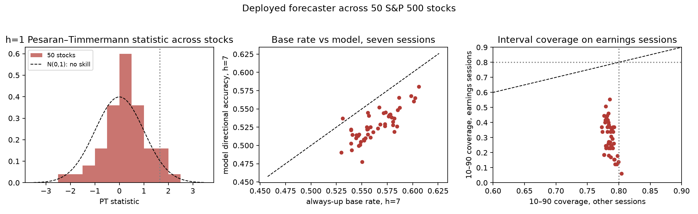

---

### 5.8 What moved Bitcoin: significant decreases and the forecast issued the day before

Section 5.6 attributed the single-stock increases to their news. The same exercise for Bitcoin's decreases, the events the product's users fear most, uses the 43 BTC/USD sessions with $z\le-2.5$, the same-session S&P 500 and Treasury moves, the FOMC and payroll calendar, the headline archive from 2024-02 and, before it, attributions from the public record with a confidence flag (`btc_manual_attributions.json`; three sessions have no identifiable catalyst and are marked as such). Table 23 groups the sessions by factor and Table 24 lists the ten largest; the full catalogue is `BTC_DECLINES.md`.

**Table 23. Bitcoin down-shocks ($z\le-2.5$, 2021-02 to 2026-08) by factor.** macro = a market-wide move or scheduled release; crypto = an exchange, protocol, regulatory or flow event specific to crypto; mixed = both. S&P 500 is the same or last equity session.

| factor | sessions | mean BTC % | mean S&P 500 % | mean BTC over the next 7 sessions % |
|---|---|---|---|---|
| macro | 17 | -6.9 | -2.12 | -1.3 |
| mixed | 14 | -7.8 | -1.28 | -3.1 |
| crypto | 12 | -7.9 | -0.15 | -1.3 |

**Table 24. The ten largest single-session Bitcoin decreases and what moved them.** Attribution from the public record (pre-2024) or the Benzinga archive; confidence flags in `btc_declines_catalogue.csv`.

| date | BTC % | S&P 500 % | factor | what happened | P(up), consensus the session before | +7 sessions % |
|---|---|---|---|---|---|---|
| 2022-06-13 | -15.4 | -3.8 | mixed | Celsius froze withdrawals (12 June) with Three Arrows Capital in distress; hot May CPI (10 June | 0.53, Hold | -8.6 |
| 2021-05-19 | -14.3 | -0.3 | crypto | China's three financial-industry associations banned institutions from offering crypto services | 0.50, Hold | +6.9 |
| 2022-11-09 | -14.3 | -2.1 | crypto | Binance walked away; FTX insolvent; Bitcoin fell to ~\$15.6k | 0.50, Hold | +4.7 |
| 2026-02-05 | -14.0 | -1.2 | macro | Cross-asset deleveraging: software stocks in freefall on AI-disruption fears, a violent gold an | 0.57, Hold | +5.5 |
| 2021-05-12 | -12.7 | -2.1 | mixed | Elon Musk announced Tesla would stop accepting Bitcoin over energy use (evening); hot April CPI | 0.57, Hold | -25.8 |
| 2022-05-09 | -11.6 | -3.2 | mixed | TerraUSD lost its peg (7-9 May) and LUNA collapsed; coincided with a 3% equity sell-off | 0.58, Buy | -0.8 |
| 2021-09-07 | -11.1 | -0.4 | crypto | El Salvador's Bitcoin Law took effect; flash crash with exchange outages and ~\$3.5bn liquidatio | 0.52, Hold | +0.6 |
| 2022-01-21 | -10.4 | -2.0 | mixed | Fed-tightening fears and a Nasdaq correction; Russia's central bank proposed a crypto ban (20 J | 0.45, Hold | +3.6 |
| 2022-08-19 | -10.2 | -1.3 | mixed | Liquidation cascade (~\$550m) on a strong dollar and hawkish Fed commentary; no single crypto ca | 0.40, Sell | -2.8 |
| 2022-11-08 | -9.9 | +0.5 | crypto | FTX liquidity crisis: FTT collapse and Binance's non-binding offer to acquire FTX | 0.35, Hold | -9.0 |

Three findings. First, the factors split roughly evenly (17 macro, 14 mixed, 12 crypto-specific) and 42% of the sessions coincided with an S&P 500 fall of 1.5% or more: almost half of what a crypto user experiences as Bitcoin news is the equity market. Second, nothing observable the day before flagged them. A headline spike on $T-1$ raises the next-session shock probability from 2.0% to 3.2% and an S&P 500 fall of 1.5% from 2.1% to 3.8%; the model's P(up) averaged 0.49, its consensus said Sell before 9% of them, its 3-day signal was Short before 5%, and its 10–90 band covered none (Proposition 3). Third, they continued: -1.9% on average over the next seven sessions, the downside counterpart of the continuation of Section 6.1. Figure 15 draws the forecast issued the session before each of twelve major declines against the realized path. At session 1 the close lies below the P10 in all twelve (an 80% band should miss low about once in twelve); the median pointed up or flat in 7 of twelve; P(up) averaged 0.49 and the consensus said Sell in 2; and the 5 paths that are back inside the band by session 7 are there because the band is 25–35 points wide by then, not because the call was right (mean realized move -12%).


## 6. Results III — after the news: human traders versus the model

### 6.1 Post-shock drift

**Table 7. Sign-adjusted continuation after the shock close (position opened at $C_T$ in the shock direction).** (Fig. 6)

| $k$ sessions | BITO mean % (share > 0) | BTC mean % (share > 0) | BTC $t$ ($p$) |
|--------|-----------|-----------|------------|
| 1 | +0.07 (56%) | +0.13 (49%) | 0.34 (0.73) |
| 2 | +0.34 (54%) | +0.95 (58%) | 2.18 (0.032) |
| 3 | +1.15 (56%) | +1.22 (58%) | 2.20 (0.030) |
| 5 | +2.00 (60%) | +2.45 (61%) | 2.91 (0.005) |
| 7 | +1.61 (54%) | **+2.98 (62%)** | **3.06 (0.003)** |

Concerning BTC (98 events), the drift is monotonic and significant from the second session onward: in 62% of cases a trader who merely follows the movement on the news day ends up with about 3% more over the following week, the result being positive. When looked at in terms of direction, up-shocks still produce a return of +3.8% after seven sessions and down-shocks lead to a return of −1.9% (for BTC); for BITO, up-shocks still yield +3.4% while down-shocks show a slight reversal (+0.4%, with $n=22$). This is precisely the type of post-announcement drift or under-reaction which is described in the behavioural finance literature (Barberis et al., 1998; Chan, 2003; Hong & Stein, 1999), the pattern having been observed in a 24/7 asset with the exception of the small sample size.

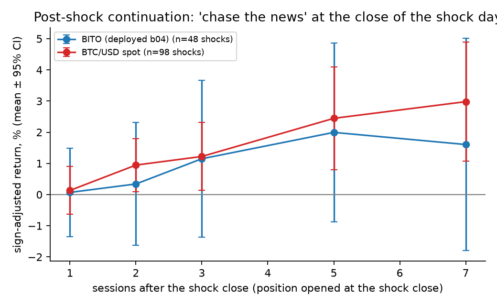

#### 6.1.1 When to act: entry delay and a walk-forward rule

If people respond with a delay, the practical issue for the user becomes whether or not acting one, two or three sessions after the news still yields any results. Table 19 provides the in-sample answer: it shows the sign-adjusted return from the close of session *k* to the close of session 7, by event set. Table 20 then tests it as a **trading rule, walk-forward and net of costs**: at each shock the direction (continuation or reversal) is chosen from the trailing $t$-statistic of prior, fully observed events only (≥20 events; $|t|>1$ to trade), the position is opened at the close of session *k* and closed at session 7, and 5 or 25 basis points are paid per side (the latter approximating crypto spreads on shock days). Compounded totals are not given for the pooled stock groups since dozens of stocks experience a shock on the same day; the means, hit rates and $t$-statistics are stated on a per-event basis.

**Table 19. Return from entering *k* sessions after a shock and holding to session 7, sign-adjusted, % (share of events positive), in-sample.**

| event set | enter day 0 | day 1 | day 2 | day 3 | day 5 |
|------------------------------------|-----------|-----------|-----------|-----------|-----------|
| BTC, all 98 shocks | +2.98 (62%) | +2.79 (64%) | +1.95 (61%) | +1.69 (59%) | +0.50 (49%) |
| BTC, 55 up-shocks | +3.83 (65%) | +3.26 (69%) | +2.04 (62%) | +1.75 (60%) | +0.60 (49%) |
| BITO, 46 shocks | +1.61 (54%) | +1.69 (61%) | +1.50 (59%) | +0.60 (50%) | -0.20 (52%) |
| SPY, 98 shocks | -0.52 (43%) | -0.25 (43%) | -0.37 (41%) | -0.31 (48%) | -0.03 (50%) |
| SPXL, 96 shocks | -1.38 (41%) | -0.78 (45%) | -1.12 (41%) | -1.06 (45%) | -0.13 (49%) |
| 4 stocks, 77 earnings up-jumps | +2.26 (64%) | +1.44 (64%) | +0.82 (64%) | +0.30 (56%) | +0.78 (68%) |
| 4 stocks, 166 idiosyncratic up-jumps | +1.10 (51%) | +0.82 (51%) | +1.07 (53%) | +0.86 (52%) | -0.06 (54%) |
| 4 stocks, 99 market-wide up days | +0.58 (55%) | +1.23 (58%) | +0.41 (56%) | +0.56 (58%) | +0.75 (55%) |

**Table 20. Walk-forward, cost-adjusted rule: enter at the close of session *k*, exit at session 7; side chosen from prior events only.**

| group | enter day | OOS events / traded | side chosen | net per event, 5 bp (hit, t) | net per event, 25 bp (hit, t) | since 2025, 5 bp | always-continuation, 5 bp (hit, t) |
|---------------------------------------|-----|-----------|------------------|---------------------|---------------------|--------------|---------------------|
| BTC | 0 | 77 / 77 | continuation | **+2.51%** (61%, t 2.32) | +2.11% (60%, t 1.95) | 2.207% (n 30) | +2.51% (61%, t 2.32) |
| BTC | 1 | 77 / 77 | continuation | **+2.33%** (64%, t 2.5) | +1.93% (61%, t 2.07) | 2.359% (n 30) | +2.33% (64%, t 2.5) |
| BTC | 2 | 77 / 77 | continuation | **+1.34%** (60%, t 1.64) | +0.94% (56%, t 1.15) | 1.424% (n 30) | +1.34% (60%, t 1.64) |
| BTC | 3 | 77 / 70 | continuation | **+1.24%** (60%, t 1.59) | +0.84% (53%, t 1.08) | 1.451% (n 30) | +1.37% (61%, t 1.89) |
| BITO | 1 | 26 / 0 | filter never fires | — | — | — | 4.013% (0.692, t 2.6) |
| SPY | 0 | 78 / 54 | reversal | **-0.01%** (48%, t -0.03) | -0.41% (46%, t -0.77) | 0.677% (n 16) | -0.56% (41%, t -1.38) |
| SPXL | 0 | 76 / 37 | reversal | **-0.23%** (51%, t -0.13) | -0.63% (46%, t -0.36) | 0.535% (n 11) | -1.28% (41%, t -1.04) |
| 50 stocks: earnings shocks (both signs) | 0 | 1366 / 1014 | continuation 94% | **+0.18%** (53%, t 1.13) | -0.22% (48%, t -1.45) | 0.63% (n 162) | +0.25% (52%, t 1.9) |
| 50 stocks: earnings shocks | 1 | 1366 / 126 | mixed | **-0.50%** (44%, t -1.45) | -0.90% (38%, t -2.62) | -0.724% (n 20) | +0.03% (52%, t 0.22) |
| 50 stocks: idiosyncratic shocks | 0 | 3845 / 168 | rarely fires | **-0.31%** (45%, t -0.99) | -0.71% (40%, t -2.26) | —% (n 0) | -0.09% (48%, t -1.02) |
| 50 stocks: market-wide shocks | 0 | 2800 / 2733 | reversal 92% | **+0.30%** (53%, t 2.65) | -0.10% (49%, t -0.93) | 1.54% (n 214) | -0.64% (43%, t -5.82) |
| 50 stocks: market-wide shocks | 2 | 2800 / 2750 | reversal | **+0.17%** (53%, t 1.63) | -0.23% (48%, t -2.22) | 2.361% (n 214) | -0.70% (43%, t -6.88) |

The answer is narrow. **For Bitcoin, yes — within one session.** Entering at the shock close or the next close earns +2.51% and +2.33% net per event at 5 bp (61%/64% of events positive, $t$ = 2.32/2.5) and +1.93% at 25 bp; the trailing filter chose continuation at every decision, so the rule is out of sample only in the sense that 21 prior events were required, and it held in 2025–26 (+2.36%, 70% hit, 30 events). By the second session the edge is halved (+1.34%, $t$ = 1.64) and is no longer significant; by the third it is even weaker; by the fifth it has disappeared. BITO has too few events for the filter to fire. **For the index, no:** chasing loses (-0.56% per event at 5 bp, -0.96% at 25 bp, $t$ = -2.36) and the reversal the filter selects earns nothing net. **For single stocks, no as a rule:** across 1,390 earnings shocks in 50 names the walk-forward continuation is +0.25% per event at 5 bp and -0.15% at 25 bp — the +2.3% of Table 14 was the four mega-caps' upward jumps, not the universe — idiosyncratic moves have no drift, and market-wide moves reverse (+0.30% at 5 bp, $t$ = 2.65; -0.10% at 25 bp). The per-event dispersion is 7 to 10% compared to a mean of 2 to 3% even in the case of Bitcoin, so about four out of every ten events result in a loss even in the best scenario for entry. The defensible product statement is therefore purely descriptive and specific to type: following a crypto shock, do not fade it, and any action taken should be carried out within one session and held for about a week; after index shocks and on days when the market as a whole moves, do not chase; after earnings and other company news, the historical drift is too small to cover real-world costs.

### 6.2 How long the model takes to agree

When the system is not aligned at time $T-1$, the 3-day signal agrees with the direction of the shock for a median of 2 sessions in the case of BITO and 3 in the case of BTC; of the 98 BTC events, 24 never showed agreement within 15 sessions. For the seven-vote consensus, a median of 5 sessions is required for BITO and 6 for BTC (see Fig. 7). Given the drift in Table 7, **the model's agreement arrives after most of the exploitable continuation has passed**, and on the BTC instrument the 3-day signal's cash-mode trend filter forces "Long" for long stretches regardless, so "alignment" there is partly coincidental.

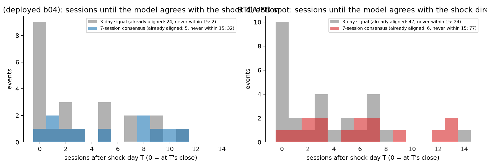

### 6.3 Case study: the 2026-08-19 White House crypto summit

On 2026-08-19 President Trump hosted crypto executives and the SEC/CFTC chairs at the White House and urged Congress to pass the CLARITY Act; Bitcoin rose from \$64,686 (Aug 18 close) to \$69,311, \$73,012 and \$78,332 on Aug 19–21 (+7.2%, +5.3%, +7.3%; +21.1% in three sessions), the largest single-day short liquidation in Bitcoin's history (≈\$1.42 bn). BITO rose +5.96%, +6.05%, +6.12%. Aug 19 is the largest $|z|$ (6.4) in our 2024–2026 sample and a headline spike ($\nu=2.0$; 2.25 on Aug 20).

**Table 8. Deployed BITO forecast issued 2026-08-18 (close 8.73), 3-day signal Short, consensus Hold (2 Buy / 3 Sell), next-session tactical target −100% (fully in the inverse ETF BITI).** (Fig. 1, 2)

| $h$ | session | $\hat p$ | P10 % | P50 % | P90 % | realized % | covered | $s$ |
|----|-------|----|------|-----|-----|--------|-------|----|
| 1 | Aug 19 | 0.55 | −1.81 | +0.32 | +2.06 | **+5.96** | no | 3.7 |
| 2 | Aug 20 | 0.53 | −2.06 | +0.17 | +2.80 | **+12.37** | no | 6.4 |
| 3 | Aug 21 | 0.58 | −2.22 | +0.70 | +3.82 | **+19.24** | no | 7.9 |
| 4 | Aug 24 | 0.58 | −5.76 | +0.68 | +3.34 | +21.76 | no | 5.9 |
| 5 | Aug 25 | 0.58 | −8.30 | +0.29 | +4.44 | +22.05 | no | 4.4 |
| 6 | Aug 26 | 0.52 | −9.49 | +0.17 | +4.91 | +21.31 | no | 3.8 |
| 7 | Aug 27 | 0.47 | −10.76 | −0.39 | +4.24 | +23.48 | no | 4.1 |

There are two lessons to be drawn. First, **directional accuracy is the wrong yardstick**: by the $\hat p\ge0.5$ rule this forecast "hit" six of seven horizons, while the realized path lay 4–8 band-$\sigma$ above every median and outside every interval. The second point is that the payload's two exposure mechanisms were at odds: the analog-schedule target showed $-100\%$ (since the negative 3-day signal was the main factor in its score), while the vote consensus advised a Hold. The strategy return that was published on August 19 was $-5.86\%$ (with a long position in BITI). The 3-day signal changed to Long at the close of August 19 (following the first increase of +6%), the consensus only reached "Buy / warning" on August 21 (after having risen by +19%), and the signal then reverted to Short with a $-100\%$ target on August 24. For BTC spot the forecast issued Aug 18 was worse: consensus **Sell / confirmed (0 Buy, 6 Sell)**, $h=1$ band $[-1.6\%,+1.2\%]$ versus +7.15% ($s=6.7$), $h=3$ $s=9.5$, 0/7 coverage, 1/7 direction hits. A "news chaser" who bought BITO at the close of August 19 obtained returns of +6.1%, +12.5%, +14.9% and +14.5% after one, two, three and five sessions respectively.

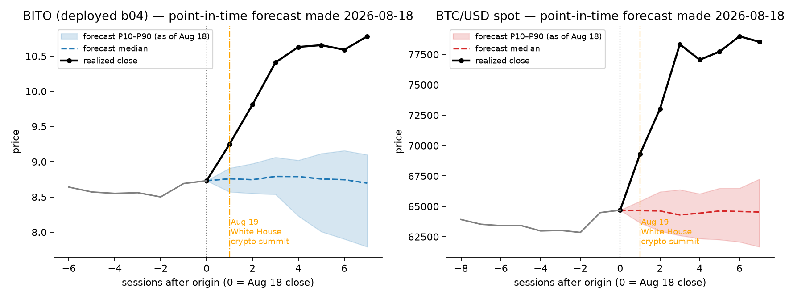

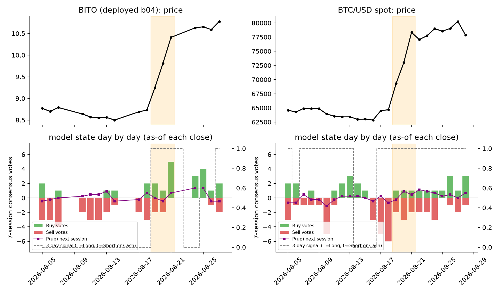

### 6.4 Effectiveness of daily actions: act every day, once a week, or once

The payload includes a seven-session exposure plan, which enables the user to address it in different ways. We simulate, point-in-time and with 5 bp per unit of turnover, (a) **act daily** — set exposure to each day's fresh $h=1$ target; (b) **act weekly** — commit to the seven-row schedule and follow it without re-forecasting, re-planning every seven sessions; (c) **act once, hold** — take the $h=1$ target and change nothing for seven sessions; against (d) buy-and-hold and (e) the deployed 3-day signal. When the exposure is negative, the actual inverse-ETF return (BITI, SPXS) is obtained. (Table 11, Fig. 11)

**Table 11. Policy performance: annualised return % / Sharpe / max drawdown % (full sample) and total return % / Sharpe / max drawdown % (2026 live period).**

| instrument | period | hold | act daily | act weekly | act once, hold | 3-day signal |
|----------|---------------------|------------------|------------------|------------------|------------------|------------------|
| BITO | full (2022-03→), ann. | **+15.8 / .55 / −68** | +5.5 / .37 / −49 | −1.1 / .17 / −53 | −23.4 / −.32 / −67 | +4.7 / .37 / −56 |
| BITO | 2026, total | −13 / −.29 / −41 | **+64 / 2.47 / −21** | +39 / 1.92 / −13 | +21 / 1.08 / −21 | +75 / 2.66 / −21 |
| BTC/USD | full (2021-04→), ann. | +5.5 / .37 / −77 | −0.4 / .18 / −75 | +7.8 / .40 / −47 | **+17.4 / .60 / −57** | +3.3 / .30 / −74 |
| BTC/USD | 2026, total | −10 / −.10 / −40 | −4 / −.07 / −27 | +4 / .33 / −29 | −5 / .00 / −33 | −5 / −.04 / −29 |
| SPXL | full (2016-05→), ann. | **+30.7 / .78 / −77** | −8.3 / .00 / −78 | −12.0 / −.26 / −77 | −15.7 / −.23 / −87 | −8.9 / .04 / −80 |
| SPXL | 2026, total | +32 / 1.25 / −27 | **+45 / 2.02 / −16** | −14 / −1.10 / −19 | −16 / −.72 / −31 | +45 / 1.80 / −19 |
| SPY | full, ann. | **+15.6 / .91 / −34** | +10.3 / .88 / −23 | +3.1 / .43 / −14 | +10.8 / .88 / −25 | +13.5 / .89 / −29 |
| SPY | 2026, total | +13 / 1.49 / −9 | +9 / 1.41 / −7 | +7 / 1.88 / −4 | +10 / 1.49 / −7 | +13 / 1.47 / −9 |
| AAPL | full (2010-05→), ann. | **+26.2 / .97 / −44** | +18.2 / .90 / −35 | +9.7 / .73 / −23 | +19.5 / .94 / −35 | +23.8 / .94 / −42 |
| MSFT | full, ann. | **+21.4 / .87 / −37** | +14.8 / .81 / −33 | +8.0 / .65 / −20 | +18.1 / .94 / −23 | +18.4 / .82 / −41 |
| TSLA | full, ann. | **+39.1 / .86 / −74** | +30.4 / .83 / −52 | +21.3 / .79 / −47 | +36.9 / .94 / −50 | +36.7 / .85 / −61 |
| NVDA | full, ann. | +50.5 / 1.12 / −66 | +38.7 / 1.13 / −49 | +19.0 / .88 / −34 | +36.6 / 1.08 / −48 | **+51.6 / 1.18 / −59** |

No policy has priority. Over full samples buy-and-hold wins on seven of eight instruments (BTC spot is the exception, where *act once and hold* wins); acting daily beats committing to the weekly schedule on the leveraged/inverse instruments but not on cash-mode stocks, where the once-and-hold user does better than the daily one; in 2026 the ranking inverts for BITO and SPXL (acting daily +64% / +45% against hold −13% / +32%) because the year contained drawdowns in which the inverse leg paid — a regime effect, not forecast skill, as Sections 4–5 show. The one robust finding concerns the schedule itself: **the committed weekly schedule and daily re-forecasting disagree by ≥25 exposure points on 66–75% of sessions** (mean absolute gap 0.30–0.50 of full exposure), so "doing nothing after day one" is a materially different strategy from acting daily — and neither is reliably the better one. Acting daily also costs 60–140 units of turnover per year (2–8% of NAV in fees at 5 bp), and on SPXL/SPXS every forecast-driven policy lost 8–16% a year over the decade against +31% a year for holding, because a $-100\%$ target in a 3× leveraged pair converts volatility drag into a structural loss.

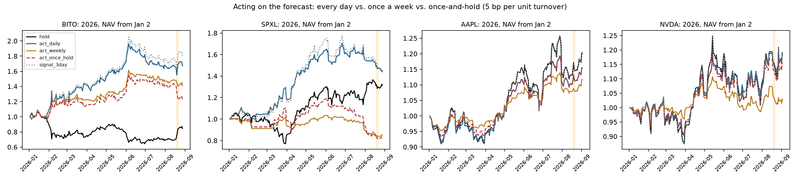

### 6.5 A constructive test: does a type-specific gate help?

If the issue is the lack of an event state variable, then introducing such a variable—even in a very rough way—should lead to an improvement in the predictive distribution exactly at those points where the paper says it fails and at no other places. We test this out of sample with **causal gates** built only from information available at the origin and thresholds fixed in Section 3: *calendar* (the target session is an FOMC/payroll day for the index or an earnings reaction session for a stock), *headline* (the previous session's own-news ratio $\nu_{t-1}\ge2$), *shock* (the origin session itself was a $\lvert z\rvert\ge2.5$ move). On gated forecasts the model's quantiles are replaced by an **event-conditional distribution estimated walk-forward from the past only**: the empirical quantiles of past same-type event sessions (earnings, FOMC/payroll; ≥8 events), or the sign-adjusted post-shock continuation distribution (≥10 shocks); otherwise a trailing 250-window climatology. The scores include the Winkler interval score (with α=0.2), coverage and Brier; the differences are calculated using block bootstrapping. (See Table 18 and Fig. 13.) Table 18.

**Table 18. Event-conditional gate vs deployed model on gated forecasts (all origins; walk-forward estimation).**

| instrument | gate | forecasts | Winkler model → gated | improvement [95% CI of difference] | coverage | Brier |
|-----------------|--------|---------|---------------|------------------------------------|-----------|----------------------------------------|
| BTC/USD | shock | 686 | 0.2954 → 0.2630 | **+11.0%** [-0.0985, +0.0274] | 0.71 → 0.76 | 0.2575 → 0.2531 |
| BTC/USD | headline | 663 | 0.2116 → 0.1888 | **+10.8%** [-0.0744, +0.0244] | 0.73 → 0.75 | 0.2641 → 0.2470 |
| BITO | shock | 333 | 0.3648 → 0.3395 | **+7.0%** [-0.1349, +0.0840] | 0.65 → 0.77 | 0.2579 → 0.2475 |
| BITO | headline | 231 | 0.3768 → 0.3143 | **+16.6%** [-0.2108, +0.0732] | 0.56 → 0.65 | 0.2709 → 0.2377 |
| SPY | calendar | 1,440 | 0.0728 → 0.0793 | **-8.9%** [-0.0111, +0.0246] | 0.72 → 0.72 | 0.2434 → 0.2402 |
| SPXL | calendar | 1,440 | 0.2180 → 0.2380 | **-9.2%** [-0.0307, +0.0743] | 0.72 → 0.71 | 0.2506 → 0.2445 |
| SPY | shock | 686 | 0.0895 → 0.0949 | **-6.1%** [-0.0173, +0.0288] | 0.69 → 0.70 | 0.2604 → 0.2507 |
| **50 stocks, pooled** | earnings | 21,763 | 0.2585 → 0.2184 | **+15.5%** [-0.0529, -0.0270], $p$=0.0 | 0.49 → 0.68 | 0.2543 → 0.2567 (94% of stocks improved) |
| **50 stocks, pooled** | headline | 21,538 | 0.1781 → 0.1706 | **+4.2%** [-0.0175, +0.0022], $p$=0.1255 | 0.77 → 0.75 | 0.2564 → 0.2519 (86% of stocks improved) |
| **50 stocks, pooled** | shock | 56,509 | 0.1397 → 0.1451 | **-3.8%** [+0.0006, +0.0103], $p$=0.027 | 0.74 → 0.75 | 0.2543 → 0.2538 (18% of stocks improved) |

Two results. First, **the gate helps where the mechanism is strongest and is statistically clear only when pooled**: on earnings sessions across 50 stocks the interval score improves by 15.5% (CI excludes zero), coverage rises from 0.49 to 0.68, and 94% of stocks improve; after crypto shocks and on crypto headline days the improvement is 7–17% per instrument with coverage restored to nominal, but with 95–686 forecasts per cell the intervals include zero. The headline gate improves stocks' Brier score significantly but not their intervals. Second, **the same rule is wrong for the other types**: the post-shock distribution *hurts* stocks (−3.8%, CI excludes zero — stocks revert, so a continuation distribution is mis-specified) and the FOMC/payroll distribution hurts the index (−9%), whose calendar-day bands are already adequately covered. The overall gains across all the forecasts are small (ranging from −2% to +2% during the 2025–26 hold-out period) because gated sessions account for only 6 to 20% of the forecasts. The gate functions as a remedy for coverage rather than as a source of alpha; its benefit is in turning a silent failure to reach 25% coverage into a flagged, calibrated 'I do not know'; and the decision about which gate to use is itself one that depends on the type, which is the paper's main constructive contribution.

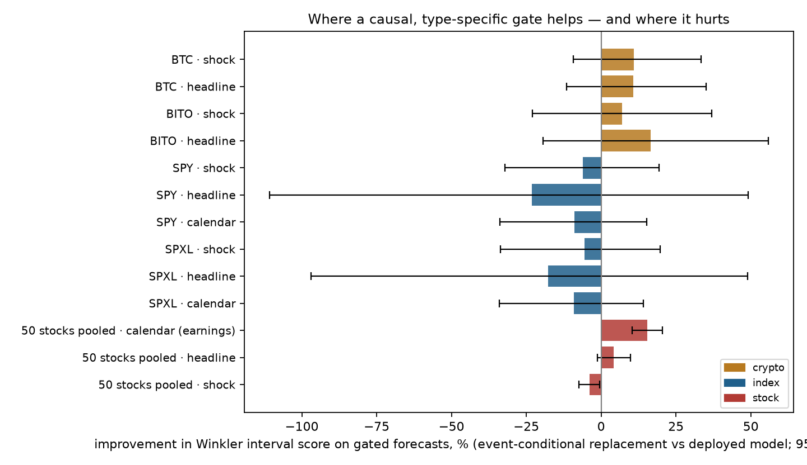

### 6.6 Beyond seven sessions: legs, quarters and half-years

The largest losses in the record are not sessions but legs. A 15% swing filter segments BTC/USD into peak-to-trough legs; fourteen legs of 20% or more have forecasts (Table 25, Figure 16). Three regularities follow. (i) Only about half of a leg's fall comes on shock sessions: the median share is 53% (range -0% to 95%); the rest arrives on ordinary sessions that no event definition flags. (ii) The model cannot tell a bear leg from a bull leg. Across the fourteen legs its seven-session P(up) averaged 0.52 and never fell below 0.40 on a 20-day mean, the consensus said Sell on 2% of sessions, the 3-day signal was Long on 67%, and holding the model's own exposure captured on average 72% of each leg's loss (−41% of the −60% leg of spring 2022, −37% of −48%, −30% of −50%). Four calendar quarters lost 20% or more (2021Q2 −40%, 2022Q2 −56%, 2025Q4 −23%, 2026Q1 −22%) and two half-years (2022H1 −57%, 2026H1 −33%); the exposure return in the four quarters was −45%, −45%, −15% and −8%: a seven-session forecaster has no state variable that spans a quarter and re-enters after every bounce. (iii) A quarter-scale state carries information the seven-session model does not. As a yardstick only (Table 26), a rule that holds when the close is above its 100-day mean and cash otherwise sat out ten of the fourteen legs entirely or in large part and cut the maximum drawdown from -72% (the model's own exposure) to -38%, paying with 52% of the time in cash and with whipsaws in 2023–24; the window length was chosen after the fact and no costs are charged.

**Table 25. Bitcoin decline legs of 20% or more (15% swing filter), 2021-04 to 2026-08, and the model's state through them.** Shock share = share of the leg's log fall on $z\le-2.5$ sessions; exposure return = holding the model's own tactical exposure (its 3-day signal, long or cash) through the leg.

| leg | days | depth | shock sessions (share) | S&P 500 | P(up) 7s | signal Long | exposure return | driver |
|---|---|---|---|---|---|---|---|---|
| 2021-04-13 → 2021-04-25 | 12 | -22.8% | 1 (25%) | +0.9% | 0.65 | 0.54 | -14.5% | Top around the Coinbase listing (14 Apr) |
| 2021-05-08 → 2021-06-08 | 31 | -43.3% | 2 (51%) | +0.0% | 0.61 | 0.59 | -30.2% | Tesla stopped Bitcoin payments (12 May), China banned institutional crypto services (18 Ma |
| 2021-06-14 → 2021-07-20 | 36 | -26.5% | 0 (-0%) | +1.7% | 0.46 | 0.35 | -10.0% | Hawkish June FOMC dot plot (16 Jun) and the Sichuan mining shutdown (19-20 Jun) that halve |
| 2021-09-06 → 2021-09-21 | 15 | -22.8% | 2 (82%) | -4.0% | 0.57 | 0.88 | -18.4% | El Salvador launch flash crash (7 Sep) then the Evergrande risk-off (20 Sep) |
| 2021-11-08 → 2022-01-22 | 75 | -48.1% | 2 (31%) | -6.3% | 0.55 | 0.74 | -36.7% | Fed pivot: Powell retired 'transitory' (30 Nov), the FOMC doubled the taper (15 Dec) and t |
| 2022-03-29 → 2022-06-18 | 81 | -60.1% | 5 (53%) | -20.4% | 0.50 | 0.49 | -40.8% | The tightening cycle bit: 50 bp (4 May) and 75 bp (15 Jun) hikes with CPI at 8.3-8.6% and  |
| 2022-08-13 → 2022-09-06 | 24 | -23.2% | 1 (41%) | -8.5% | 0.45 | 0.52 | -6.5% | Strong dollar and Jackson Hole 'pain' speech (26 Aug) |
| 2022-11-05 → 2022-11-21 | 16 | -26.0% | 2 (86%) | +4.8% | 0.47 | 0.35 | -13.6% | FTX collapse (8-11 Nov) and contagion (Genesis halted withdrawals 16 Nov) |
| 2023-07-13 → 2023-09-11 | 60 | -20.1% | 2 (50%) | -0.2% | 0.41 | 0.70 | -19.7% | Fade after the Ripple ruling |
| 2024-05-20 → 2024-07-07 | 48 | -21.9% | 3 (54%) | +5.0% | 0.48 | 1.00 | -21.9% | Hawkish June FOMC dots (12 Jun), Mt. Gox repayment announcement (24 Jun) and German govern |
| 2024-07-28 → 2024-08-05 | 8 | -20.9% | 2 (58%) | -5.0% | 0.56 | 1.00 | -20.9% | Weak July payrolls (2 Aug) then the yen carry-trade unwind (5 Aug) |
| 2024-12-17 → 2025-04-08 | 112 | -28.2% | 5 (95%) | -17.3% | 0.55 | 0.91 | -27.5% | Hawkish December FOMC (18 Dec) |
| 2025-10-06 → 2026-02-05 | 122 | -49.7% | 6 (64%) | +1.2% | 0.55 | 0.76 | -29.9% | The 10 Oct tariff shock and record \$19bn liquidation |
| 2026-05-10 → 2026-06-30 | 51 | -28.8% | 1 (20%) | +1.5% | 0.49 | 0.60 | -21.3% | U.S. strikes on Iran and oil, rate-hike bets and \$480m/\$500m ETF outflows on 1-3 Jun |

**Table 26. A slow regime layer as a yardstick, BTC/USD 2021-04 to 2026-08 (in-sample; no costs).** Trend filters hold when the close is above its moving average and cash otherwise, decided at the previous close.

| rule | CAGR | max drawdown | time in market |
|---|---|---|---|
| MA50 filter (cash below) | +22.3% | -57.6% | 0.50 |
| MA100 filter (cash below) | +23.8% | -37.8% | 0.48 |
| MA200 filter (cash below) | +18.4% | -35.9% | 0.49 |
| 7-session model exposure | +6.0% | -72.5% | 0.78 |
| buy and hold | +5.8% | -76.7% | 1.00 |

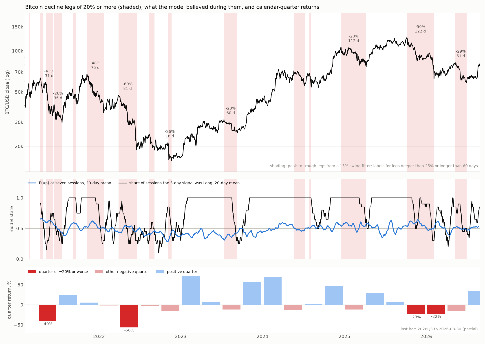

### 6.7 The same lens on the index, Treasuries and single stocks

With a volatility-scaled threshold the same segmentation applies to both directions on every asset type, including long Treasuries (TLT), on which the engine does not run (Table 27; Figures 17 and 18; the largest legs of each asset with their drivers are listed in `SWING_LEGS.md`). Three regularities hold across types. The grind, not the jumps: shock sessions carry about half of a Bitcoin down leg but a third or less of an index, stock or bond leg, and less of up legs; Nvidia's −44% leg of spring 2022 had no shock session at all, and TLT's 2020–23 bear market was three slow legs of six to nine months. The model cannot tell a bear leg from a bull leg on any type: its seven-session P(up) is the same inside down legs as inside up legs (0.52 against 0.48 for crypto, 0.63 against 0.63 for the index, 0.53–0.58 either way for the stocks), and holding its exposure captured 66–79% of every down leg's loss — and most of every rally, which is the always-up result of Section 5.4 at leg scale. The trend yardstick is type-specific (Table 28): transformative for crypto, a drawdown-for-return trade on the index, costly for single stocks whose rallies are long grinds a filter keeps exiting, and useless for Treasuries. The drivers differ by type as well: crypto legs are policy and crypto-internal failures in both directions (ETF approval and inflows on the way up); index legs are macro only (tariffs, the hiking cycle, COVID); bond legs are the rate cycle itself; stock legs are mostly own news (product cycles, guidance, export controls, management), with the 2022 and 2025 macro legs shared. What a longer-horizon layer should hold is therefore itself a type decision, which is the argument of Section 8.3.

**Table 27. Swing legs by asset type, both directions.** Reversal threshold = a quarter of annualized volatility (floor 5%, cap 15%); a leg counts above 4/3 of it. Shock share = median share of the leg's log move on $|z|\ge2.5$ sessions in the leg's direction. Loss captured = exposure return divided by leg depth, mean over down legs.

| asset | reversal / min leg | legs down / up | shock share, down legs | shock share, up legs | P(up) 7s in down legs | P(up) 7s in up legs | loss captured in down legs |
|---|---|---|---|---|---|---|---|
| BTC/USD | 14% / 19% | 16 / 23 | 0.51 | 0.36 | 0.52 | 0.48 | 0.69 |
| S&P 500 (SPY) | 5% / 7% | 23 / 26 | 0.36 | 0.00 | 0.63 | 0.63 | 0.68 |
| 20y+ Treasuries (TLT) | 5% / 7% | 20 / 16 | 0.23 | 0.18 | no engine | — | — |
| Apple | 7% / 9% | 53 / 56 | 0.33 | 0.23 | 0.57 | 0.58 | 0.74 |
| Microsoft | 6% / 9% | 52 / 52 | 0.28 | 0.28 | 0.57 | 0.55 | 0.66 |
| Tesla | 14% / 19% | 45 / 53 | 0.33 | 0.25 | 0.53 | 0.53 | 0.79 |
| Nvidia | 11% / 15% | 42 / 51 | 0.06 | 0.18 | 0.55 | 0.57 | 0.73 |

**Table 28. The trend yardstick by asset (in-sample; no costs), from the first forecast origin.** CAGR / maximum drawdown.

| asset | from | MA100 | MA200 | model exposure | buy and hold |
|---|---|---|---|---|---|
| BTC/USD | 2021-04-05 | +23.8% / -37.8% | +18.4% / -35.9% | +6.0% / -72.5% | +5.8% / -76.7% |
| S&P 500 (SPY) | 2016-05-18 | +11.4% / -17.7% | +11.7% / -19.8% | +14.3% / -29.0% | +15.6% / -33.8% |
| 20y+ Treasuries (TLT) | 2016-12-29 | -1.6% / -37.8% | -2.4% / -45.5% | — | -0.9% / -48.4% |
| Apple | 2010-05-19 | +16.3% / -29.7% | +19.5% / -35.3% | +24.7% / -40.8% | +26.0% / -43.8% |
| Microsoft | 2010-05-19 | +7.7% / -36.6% | +12.5% / -40.2% | +19.5% / -39.9% | +21.3% / -37.1% |
| Tesla | 2010-11-10 | +14.2% / -67.7% | +15.7% / -71.2% | +38.5% / -60.6% | +40.6% / -73.6% |
| Nvidia | 2010-05-19 | +30.8% / -66.3% | +46.2% / -54.2% | +52.8% / -58.8% | +50.6% / -66.3% |

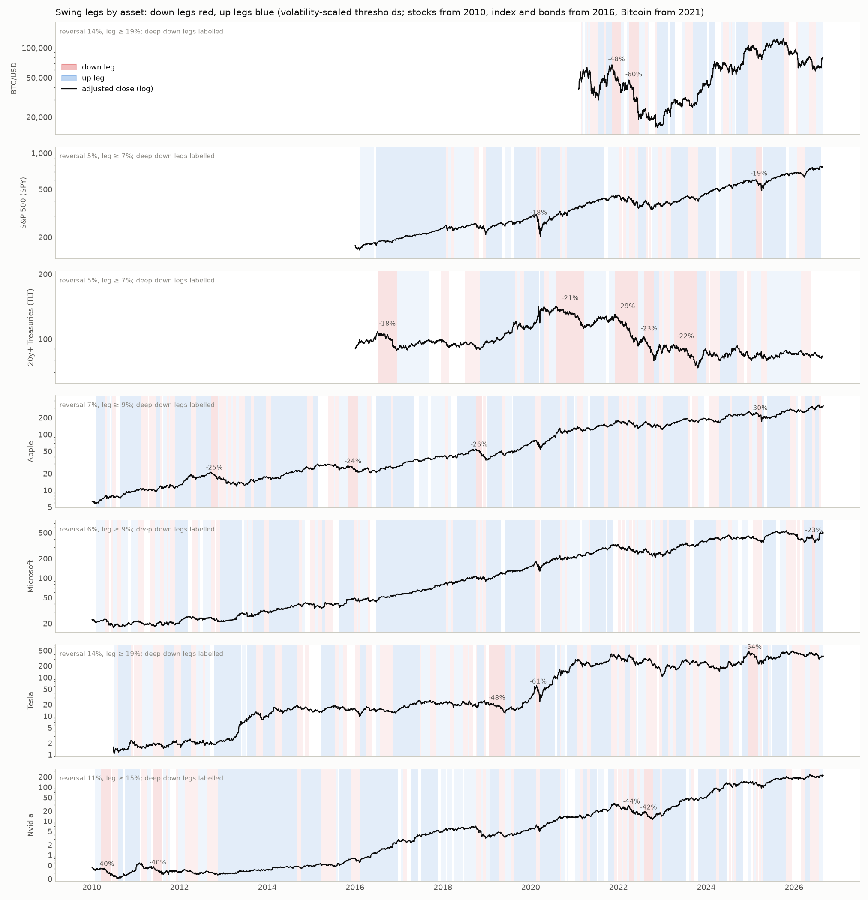

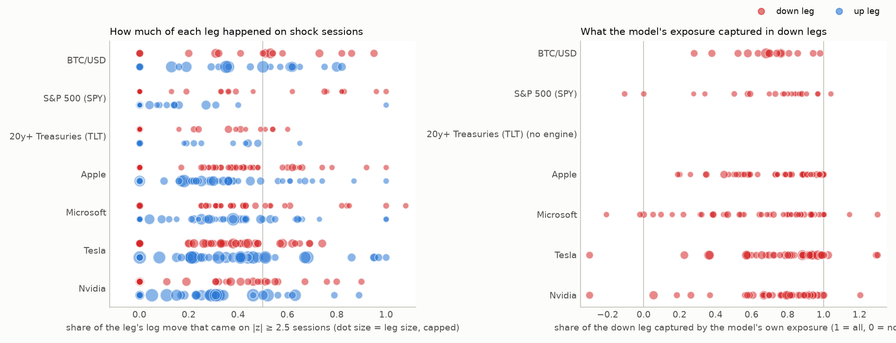

---

## 7. Discussion and limitations

### 7.1 Propositions: why a price-conditioned predictor cannot be effective on news days

Let $\mathcal F^P_t=\sigma(C_s:s\le t)$ be the price filtration and write the next session return as
$$r_{t+1}=\mu_t+\sigma_t\,\varepsilon_{t+1}+\xi_{t+1}N_{t+1},$$
with $\mu_t,\sigma_t$ $\mathcal F^P_t$-measurable, $\varepsilon_{t+1}$ continuous and symmetric with $\varepsilon_{t+1}\perp\!\!\!\perp(\mathcal F^P_t,N_{t+1},\xi_{t+1})$, $N_{t+1}\in\{0,1\}$ the news indicator and $\xi_{t+1}$ the news impact. *Exogeneity* means $(N_{t+1},\xi_{t+1})\perp\!\!\!\perp\mathcal F^P_t$; write $q=P(\xi>0\mid N=1)$. A *price-conditioned predictor* is any $\mathcal F^P_t$-measurable variable $D_t\in\{-1,+1\}$ (an example of such a predictor is the analog forecaster’s $\mathbf 1\{\hat p_t\ge\tfrac12\}$). The accuracy with respect to an event $E$ is defined as $A(E)=P(D_t=\operatorname{sgn} r_{t+1}\mid E)$.

**Proposition 1 (news-day accuracy does not depend on the predictor).** On $E_c=\{N_{t+1}=1,\ |\xi_{t+1}|\ge c\,\sigma_t\}$,
$$\big|A(E_c)-\big[q\,P(D_t=+1)+(1-q)\,P(D_t=-1)\big]\big|\;\le\;P\big(|\varepsilon_{t+1}+\mu_t/\sigma_t|\ge c\big),$$
which for Gaussian $\varepsilon$ and $|\mu_t|\ll\sigma_t$ is $\le 2\Phi(-c)$ ($=0.012$ at $c=2.5$). Specifically, $A(E_c)\le\max(q,1-q)+2\Phi(-c)$, and if the direction of the news is unpredictable ($q=\tfrac12$) then each price-conditioned predictor has a news-day accuracy of $\tfrac12\pm0.012$ — in that case the predictor is irrelevant.

*Proof.* On $E_c$, $\operatorname{sgn} r_{t+1}=\operatorname{sgn}\xi_{t+1}$ unless $|\mu_t+\sigma_t\varepsilon_{t+1}|\ge|\xi_{t+1}|\ge c\sigma_t$, an event of probability at most $P(|\varepsilon+\mu_t/\sigma_t|\ge c)$. On the complement, $\{D_t=\operatorname{sgn} r_{t+1}\}=\{D_t=\operatorname{sgn}\xi_{t+1}\}$, and since $D_t$ is $\mathcal F^P_t$-measurable while $\xi_{t+1}\perp\!\!\!\perp\mathcal F^P_t$, $P(D_t=\operatorname{sgn}\xi_{t+1})=\sum_{d=\pm1}P(D_t=d)\,P(\operatorname{sgn}\xi_{t+1}=d)=qP(D_t=+1)+(1-q)P(D_t=-1)$. $\square$

**Proposition 2 (clustered news and a contrarian predictor give accuracy below one half).** Suppose successive news impacts are positively dependent, $P(\operatorname{sgn}\xi_{t+1}=\operatorname{sgn}\xi_t\mid N_t=N_{t+1}=1)=\tfrac{1+\rho}{2}$ with $\rho\in(0,1]$, and the predictor fades large moves, $D_t=-\operatorname{sgn} r_t$ on $\{N_t=1\}$. Then on consecutive days with jump-dominant news we have $A=\tfrac{1-\rho}{2}<\tfrac12$.

*Proof.* On a jump-dominant news day $t$, $\operatorname{sgn} r_t=\operatorname{sgn}\xi_t$, so $D_t=-\operatorname{sgn}\xi_t$ and $A=P(\operatorname{sgn}\xi_{t+1}=-\operatorname{sgn}\xi_t)=1-\tfrac{1+\rho}{2}$. $\square$

When there are large price changes, the analog forecaster behaves in a contrarian manner because the companies nearby are located in periods marked by calmness, during which large one-day movements tend to partly reverse; of the 98 instances of BTC shocks and 48 instances of BITO shocks, 21 and 10 respectively were followed by another shock within three sessions, almost always of the same sign (the most clear example being the period from August 19 to 21, 2026). Proposition 2 therefore predicts the observed lack of skill on shock days (see Table 3: PT = $-2.49$ for BTC; accuracy at $h=1$ is 0.37).

**Proposition 3 (interval coverage on news days is bounded by jump size).** Let $[L_t,U_t]=[\mu_t+\sigma_t z_{0.1},\ \mu_t+\sigma_t z_{0.9}]$ be the central 80% interval of the diffusion part with Gaussian $\varepsilon$. On $\{N_{t+1}=1,\ \xi_{t+1}=c\,\sigma_t\}$,
$$P\big(r_{t+1}\in[L_t,U_t]\big)=\Phi(z_{0.9}-c)-\Phi(z_{0.1}-c)\le\Phi(1.2816-c),$$
which equals $0.111$ at $c=2.5$ and $0.013$ at $c=3.5$. Since the observed coverage on $|z|\ge2.5$ days is within this mechanical bound, it carries no information about the forecaster; it is the coverage conditioned on headline intensity (Table 5) that is informative, because that definition does not fix $c$.

*Proof.* $r_{t+1}\in[L_t,U_t]\iff\varepsilon_{t+1}+c\in[z_{0.1},z_{0.9}]$; take probabilities and drop the negative term. $\square$

**Proposition 4 (aggregate effectiveness is capped by news frequency).** With $\pi=P(N_{t+1}=1)$ and $q=\tfrac12$, $A=(1-\pi)A_{\text{calm}}+\pi A_{\text{news}}\le(1-\pi)A_{\text{calm}}+\tfrac{\pi}{2}+\pi\,2\Phi(-c)$, and under the hypotheses of Proposition 2 the news term can fall to $\pi\tfrac{1-\rho}{2}$. Reading a headline accuracy of $0.65$ with $\pi=0.05$ would require $A_{\text{calm}}\ge0.658$; the calm-session PT statistics of $+0.47$ and $-0.54$ (Table 3) reject any such calm-period skill.

**Remark (sequential effectiveness).** If a probabilistic forecaster's $\hat p_t$ equals the true conditional probability, then $E[\Lambda_{t+1}-\Lambda_t\mid\mathcal F_t]=\mathrm{KL}(\hat p_t\,\|\,\tfrac12)\ge0$ by Gibbs' inequality, so $\Lambda_n$ is a submartingale and the even-odds Kelly bet has non-negative expected log growth; both are the operational meaning of "effective in series". The fact that the observed value of $\Lambda_n<0$ is less than zero at each horizon (as shown in Table 2) indicates that the forecaster’s deviations from $\tfrac12$ are, on average, in the wrong direction — which is exactly the situation that Propositions 1–2 predict when a share $\pi$ of the sessions is news-driven and the predictor is contrarian about them.

### 7.2 What is and is not mechanical

**What is and is not mechanical.** Zero interval coverage on $|z|\ge2.5$ days at $h=1$ is essentially implied by the definitions (Section 1) and we do not count it as evidence. The evidence instead consists of: (i) directional accuracy falling *below* 50% on the largest moves and on days with a headline spike; (ii) a monotonic decline in both coverage and surprise when using a news measure which never observes returns; (iii) the drift that occurs after shocks; and (iv) the latency before the model reaches agreement. Together, (i) through (iv) are precisely what one would expect from a forecaster whose analog pool is mainly composed of calm, mean-reverting regimes and which lacks the ability to represent "information has arrived".

**Why an analog forecaster fails here.** Write the return as
$$r_t=\mu(x_{t-1})+\sigma(x_{t-1})\,\varepsilon_t+J_t,\qquad J_t=\sum_{k:\tau_k\le t}\xi_k\,K(t-\tau_k;\theta),$$
where $\tau_k$ are news arrival times, $\xi_k$ the impact sizes, and $K(\cdot;\theta)$ a *response kernel* describing how the population of traders digests the news over the following sessions (Merton 1976 for the jump; the kernel is the behavioral addition). A method using the nearest neighbour approach can estimate only the conditional distribution of $r$ given $x_{t-1}$. Since $x_{t-1}$ provides no information about $\tau_k$ or $\xi_k$, the forecast at time $T-1$ is incapable of detecting the jump; more seriously, as the kernel $K$ is not available in the state, the forecasts at times $T$ and $T+1$ record a large positive value of $r_T$ and, basing themselves on calm analogues, predict a partial reversal, which is exactly the opposite of the drift shown in Table 7. Shocks also have a tendency to cluster — in the case of BITO, 10 out of 48 and in the case of BTC, 21 out of 98 shock days are followed by another shock within three sessions (August 19, 20 and 21 were consecutive z-shocks; 2026-02-05/06; 2024-08-05/08) — showing self-excitation (Bacry et al., 2015; Hawkes, 1971) both in the arrival of news and in the human response.

**Type-specific failure modes.** Section 5.4 shows the shared engine fails in three different ways: on crypto it is contrarian into clustered, continuing news shocks (anti-skill); on the index its directional accuracy is base-rate inflation and it collapses on the predominantly downward, heavy-tailed shocks (−26 points) even though its contrarian bias is directionally right afterwards (fast re-alignment); on single stocks the trend filter degenerates to "always Long" and shocks are idiosyncratic earnings/product news on which the analog pool carries no information either way. It is not possible for one set of indicators, one selection window, one vote threshold and one analog feature vector to be correctly specified at the same time for a 24/7 momentum-prone asset, a mean-reverting negatively skewed index and a cross-section of idiosyncratic jump processes.

**A portfolio corollary.** The same taxonomy explains why the index, which has no earnings of its own, is the instrument on which long-horizon investing has been stable: an index of five hundred idiosyncratic information streams cancels exactly the risk this paper shows to be unforecastable, leaving scheduled macro news, shocks that revert (Table 8) and the equity premium behind the always-up base rate of Table 9. The approach also involves the conventional 60/40 stock–bond strategy with rebalancing—that is, selling bonds to buy stocks after a decline and carrying out the opposite operation after a rise—which is a *concave*, contrarian rule within the taxonomy developed by Perold and Sharpe (1988): it generates profits when markets are oscillating and offsets its insurance costs when they are trending, with a rebalancing bonus equal to about half the variance that is eliminated (Bernstein & Wilkinson, 1997; Hallerbach, 2014). On this archive the strategy performs as the type results predict (Appendix E, Table 21, Fig. 14): in the SPY/TLT portfolio over the period 2016–2026, a rebalanced 60/40 allocation reduced volatility from 17.5% to 11% and the maximum drawdown from −34% to −27%, without increasing returns or the Sharpe ratio, because long-term Treasuries lost money and fell in line with the stocks in 2022 (the daily return correlation between SPY and TLT was −0.4 from 2016 to 2020 and became positive in every year from 2022; see Appendix E); in the BTC/TLT case the rebalancing bonus of an asset with 58% volatility produced additional returns, while buying at the bottom of the week following a crypto market shock resulted in a loss—the continuation of Section 6.1 once again. Constant-mix rebalancing is therefore the appropriate policy for the index type and the wrong reaction to take during the first week after a crypto market shock; we are presenting it here as an example, not as an asset allocation recommendation, since drawing such a conclusion would require longer data samples, a standard bond proxy, and tests that compare Sharpe ratios.

**Recommendations for the deployed product** (no code was changed in this study): separate model families per asset type (Section 8.3); score with proper rules (Brier, pinball/CRPS) rather than directional accuracy; flag forecasts as *not applicable* when $\nu_t\ge 2$ or $|s_{t-1}|\ge2.5$ rather than emitting confident bands; reconcile the schedule target and the vote consensus into a single recommendation; label crypto-flagged ETF datasets with trading sessions rather than calendar days.

**Limitations.** (1) Offline reproduction differs from production in the rotation feature and price source (76% unfrozen signal agreement); the 2026 signals are exact. (2) News intensity is determined by the number of Benzinga headlines, which serves as a crude proxy for the level of information, salience and sentiment. (3) There are two crypto instruments, two index instruments and 50 stocks; the crypto window extends from 4.5 to 5.5 years and includes 48 and 98 shock events; the 46 stocks in the universe have not been individually verified for fidelity against the production. (4) The overlapping time horizons result in dependence; even though block bootstraps are used, the effective sample size is less than the number of rows. (5) With seven time horizons and multiple splits there is a possibility of multiplicity; we give details for all the horizons and advise the reader to treat results with $p\approx0.03$ as only suggestive. (6) Survivorship is not an issue (since there is only one instrument), but there is regime dependence: the period from 2024 to 2026 includes an ETF-approval bull run, a 2026 drawdown and a policy-driven rally. (7) The trend yardstick of Tables 26 and 28 is in-sample: window lengths were chosen after seeing the data and no costs are charged; the leg narratives before the headline archive are hand attributions from the public record, flagged by confidence.

**Calibrated area, uninformative median, no regime.** The band's coverage (Table 22) is real and is a usable risk envelope; it is also reproduced by a volatility formula with a better interval score, so the model adds nothing to the area beyond recent volatility, and the median and direction inside it are what fail. Sections 6.6–6.7 add the horizon: the model's state is the same in bear and bull legs on every asset type because nothing in its feature vector spans more than twenty sessions, and the losses users remember are legs of one to four months of which only a minority is shock sessions.

### 7.3 The predictability gap

The data given in Table 16 examine the ceiling-and-floor argument associated with Proposition 4. On every instrument, sessions with $|z|\ge2.5$ are only 3.4–5.0% of the sample yet carry **28.5–36.5% of the return variance** and 13–18% of absolute price movement; headline-spike days add a further 5–14% of sessions. It is on these sessions that, by Proposition 1, the directional accuracy of a price-conditioned model is brought close to the news-sign base rate (which is observed to be 0.37–0.56) and its interval coverage is mechanically close to zero. The accuracy during calm sessions — the only circumstance in which skill could possibly exist — is 0.49–0.53, making it no different from that of a coin and *below* the always-up base rate on the instruments that are drifting. The arithmetic shows that if the model had possessed 60% (70%) directional skill during calm sessions, its overall accuracy could still not have gone above approximately 0.60 (approximately 0.69). The 60–70% figures advertised by retail signal products are therefore not a plausible *average*; they are the *ceiling under substantial calm-period skill that this model — and, on the evidence of Section 1.1, most technical models — does not have*. The gap that this paper measures lies between the ceiling and the coin: about one third of all price variance occurs on days which the model classifies as ordinary and nothing that is based on past prices can account for that one third.

**Table 16. The predictability gap by instrument ($h$=1).** Shock = target session with $|z|\ge2.5$; ceiling = $(1-\pi)A_{\text{calm}}+\pi/2$ evaluated at hypothetical calm skill of 60% / 70%.

| instrument | type | shock sessions $\pi$ | variance on shock sessions | $\lvert r\rvert$ on shock sessions | hit calm | hit shock | hit all | always-up | headline-spike sessions | ceiling at 60% / 70% calm skill |
|----------|------|--------|--------|--------|-----|-----|-----|---------|--------------|-----------|
| BTC-USD | crypto | 5.0% | **35.4%** | 17.8% | 0.494 | 0.367 | 0.488 | 0.495 | 10.1% | 0.59 / 0.69 |
| BITO | crypto | 4.3% | **34.4%** | 15.3% | 0.512 | 0.375 | 0.506 | 0.487 | 5.3% | 0.60 / 0.69 |
| SPXL | index | 3.7% | **28.5%** | 13.2% | 0.533 | 0.385 | 0.527 | 0.548 | 4.5% | 0.60 / 0.69 |
| SPY | index | 3.8% | **28.8%** | 13.4% | 0.530 | 0.418 | 0.526 | 0.551 | 4.5% | 0.60 / 0.69 |
| AAPL | stock | 4.1% | **32.6%** | 14.9% | 0.514 | 0.494 | 0.513 | 0.530 | 11.4% | 0.60 / 0.69 |
| MSFT | stock | 4.0% | **35.2%** | 15.0% | 0.518 | 0.515 | 0.518 | 0.523 | 14.0% | 0.60 / 0.69 |
| TSLA | stock | 4.3% | **36.5%** | 16.4% | 0.496 | 0.497 | 0.496 | 0.516 | 10.6% | 0.60 / 0.69 |
| NVDA | stock | 3.4% | **30.1%** | 12.6% | 0.504 | 0.560 | 0.506 | 0.529 | 7.7% | 0.60 / 0.69 |

The gap measure has two limitations. The first is that it relies on the return-defined shock set, so the fraction of unpredictable events gives only a lower bound—one that could be raised by also including headline spikes and calendar sessions (see Sections 5.2 and 5.5); and the second is that if a model had a completely different information set—for instance, news text, order flow, or options positioning—it would not be affected by Proposition 1, the reason being that the proposition only places a bound on *price-conditioned* predictors, while the deployed engine and the technical-rule literature concern themselves with exactly that.

---

## 8. Future research: measuring the human response kernel (mathematics × neuroscience)

An important empirical fact given in this paper is that the errors committed by a pattern-based forecaster are not white; instead, they happen around and after news arrives and show a *sign* (the model does not account for movements that continue). That structure is produced by people. Therefore, in order to cope with news events a model has to include a model of how people respond to news – a question which belongs to the field of neuroscience and which has a mathematical interface.

**8.1 Mathematical program.**
1. *State augmentation.* Add to $x_t$ an observable news-intensity process $\nu_t$ and the last standardized surprise $s_{t-1}$; estimate the conditional law of $r$ given $(x_{t-1},\nu_{t-1},s_{t-1})$ and test whether the Table 7 drift becomes predictable out of sample (purged, embargoed walk-forward as in López de Prado 2018). Second, *kernel identification.*: estimate $K(\cdot;\theta)$ non-parametrically from the cross-section of shocks (this involves a deconvolution/Volterra problem); test the parametric cases of exponential decay (indicating a single-speed reaction), gamma (showing a delayed peak, in line with the idea of gradual information diffusion, as noted by Hong & Stein 1999), and mixtures (representing a fast algorithmic group plus a slow discretionary group). Third, *self-excitation.*: fit marked Hawkes processes to the arrival times of shocks with headline marks; compare the branching ratios in periods of calm with those in periods when a lot of policy news is present. Fourth, *regime gating.*: use hidden-Markov or change-point gating (as in Hamilton, 1989) so that the system switches from the analog forecaster to either abstention or a drift model when the posterior probability of the "news regime" goes above a certain threshold; assess the performance using CRPS rather than accuracy.

**8.2 Neuroscience program.** The kernel $K$ aggregates individual reaction functions whose neural substrate is already partly mapped: dopaminergic reward-prediction-error signalling (Schultz et al., 1997), anticipatory nucleus-accumbens activity before risk-seeking errors and anterior-insula activity before risk-averse errors (Kuhnen & Knutson, 2005), subcortical coding of expected reward and risk (Preuschoff et al., 2006), and autonomic arousal in professional traders during volatility (Lo & Repin, 2002); Frydman and Camerer (2016) review how such measurements discipline behavioral-finance models. Three measurements would identify $K$: (a) *reaction-time distributions* to salient financial headlines, by expertise, from behavioral tasks with EEG/fMRI in a subsample — their population mixture is a first-order estimate of $K$; (b) the separation of *forced* flow (liquidation cascades such as the \$1.42 bn of short covering on 2026-08-19, observable in order-book and funding data) from *discretionary* flow (survey and laboratory), since the two have different kernels; (c) *longitudinal panels*, because if forecasters and their users learn from published errors the kernel is non-stationary (Lo, 2004).

**8.3 A type-specific architecture.** The fingerprints of Table 10 translate directly into different state variables, event calendars and validation targets; a shared "voter" pool cannot express them.

| | crypto (BTC, BITO) | index (SPXL/SPXS, SPY) | single stocks |
|----------------------|----------------------------------------|----------------------------------------|----------------------------------------|
| dominant shock source | unscheduled policy/headline news; liquidation cascades | scheduled macro (FOMC, CPI, payrolls, expiries); heavy left tail | own-ticker news: earnings, guidance, product; 3–4× shock odds on own-headline spikes |
| post-shock dynamics | continuation +1.2–3.0% (3–7 sessions), clustering 21–31% | reversal −0.5–1.4%, VR 0.82–0.88 | heterogeneous; revert (AAPL/MSFT) or continue (TSLA/NVDA) |
| state variables to add | headline intensity $\nu_t$, last surprise $s_{t-1}$, funding/liquidation flow, post-shock age | event-calendar dummies, VIX level/term structure, skew, drawdown state | earnings-date proximity (embargo), sector-ETF residual return, beta-adjusted momentum, split state |
| session calendar | 7-day; weekend bars | NYSE sessions | NYSE sessions |
| forecaster form | regime-gated: analog in calm, drift/kernel model $K$ after shocks, abstain when $\nu_t\ge2$ | mean-reversion/vol-regime model with asymmetric loss; explicit inverse-ETF drag in the exposure map | cross-sectionally pooled analogs (peer stocks), earnings-aware; benchmark-relative gate instead of a 200-day filter |
| validation gate | CRPS + Kelly growth on shock and calm sessions separately | PT statistic against the always-up base rate; drawdown on shock windows | PT vs base rate per stock and pooled; embargoed purged CV around earnings |

The common element is not the voter set but the *evaluation contract*: every type is scored against its own base rate with a proper rule, on calm and shock sessions separately, before anything is published.

**A regime layer.** Sections 6.6–6.7 argue for a state above the seven-session forecaster: a slow regime variable (trend, a realized-volatility regime, or the event-conditional distributions of Section 6.5 extended to a calendar quarter) that gates *exposure* rather than direction. Its validation target is leg capture — the share of a decline leg's loss an exposure schedule absorbs — not next-session accuracy, and Table 28 shows the answer differs by type: large for crypto, modest for the index, negative for single stocks on trend alone, absent for Treasuries.

**8.4 News, social media and the neuroscience of collective reaction.** The 2026-08-19 rally, the documented effect of Elon Musk's posts on cryptocurrency prices (Ante, 2023) and presidential posts on Truth Social all point to a transmission chain that runs *post → attention → arousal → herding → order flow → price*, increasingly through social platforms rather than newswires. There is an empirical foundation for each stage of this chain: attention capture and attention-induced trading (Barber et al., 2022; Da et al., 2011), disagreement and herding on investor social networks (Cookson & Niessner, 2020; Pedersen, 2022), the epidemic spread of narratives (Shiller, 2017), and measurable collective mood (Bollen et al., 2011; Ranco et al., 2015). The neuroscience of social influence provides the underlying mechanisms: herd information changes the striatal valuation signals involved in financial decisions (Burke et al., 2010), conformity is caused by a reinforcement-learning error signal (Klucharev et al., 2009), the opinions of others influence reward-related valuation (Campbell-Meiklejohn et al., 2010), and anticipatory neural activity can predict financial decisions (Knutson & Bossaerts, 2007). A concrete program: (a) extend the event catalogue of Tables 14–15 into a labelled corpus with *source* (executive, political, regulator, analyst, wire), *channel* (social post vs newswire), reach and sentiment; (b) estimate the response kernel $K$ by source × channel — the hypothesis is that social-media-originated shocks have faster onset, larger short-horizon continuation and stronger clustering than newswire shocks; (c) in the laboratory, reaction-time and choice tasks with social cues (a post with visible engagement) against matched neutral headlines, recording arousal (pupil, skin conductance) and, in a subsample, fMRI, to obtain individual kernels whose mixture is $K$; (d) integrate the result into the forecaster as a social-intensity state variable $\nu^{\text{SNS}}_t$ and a post-shock drift term, and *train on labelled information events rather than on price patterns* — learning the behaviour, not the noise. This kind of measurement of social contagion in financial markets should be pre-registered and must respect privacy.

The practical goal is not to predict the news — that is impossible from prices — but to know, the moment news lands, **how the crowd will finish reacting**, and to have the model say “I do not know” until then. In this way, the current silent 0%-coverage failures would become flagged and quantifiable regimes, and the drift mentioned in Table 7 could be modelled instead of just being lost.

---

## 9. Conclusion

When evaluated exhaustively and point-in-time, the deployed seven-session analog forecaster is directionally uninformative on crypto, the index pair and single stocks alike (46–53% at every horizon); on its Bitcoin instruments it is well-calibrated in width during calm periods and systematically incorrect in both sign and width when exogenous news arrives: 37–39% next-session accuracy on shock and headline-spike days, zero interval coverage the day before a shock, and a mean surprise of 3.6 band-$\sigma$. Prices tend to move in the direction of the shock for about a week, whereas the model's consensus takes 5 to 6 sessions to catch up. The 2026-08-19 CLARITY-Act rally, a case in which the model advised a fully inverse position, is an example of this kind of failure. The root of the problem is structural in that human reactions to information do not depend on past prices, which shows that a combination of mathematical and neuroscientific methods is needed if this kind of response is to be measured and modelled. The failure is also specific to the type of situation: the same forecasting engine is contrarian when there are continuing shocks in crypto, is base-rate-inflated and prone to collapse when applied to the negatively skewed index, and is ineffective when dealing with individual stocks that experience sudden jumps due to their own news; no one schedule (whether daily, weekly, or once) performs best across all instruments. The constructive test shows the advantages of using such families of models: an event-conditioned gate that is estimated entirely from historical data restores coverage during earnings sessions (the interval coverage rising from 0.49 to 0.68 across 50 stocks, with a +15% improvement in interval score) and after crypto shocks, while using the wrong gate for a given type of event is harmful. The gap is quantified in that 3 to 5 per cent of the sessions account for 28 to 37 per cent of the return variance and cannot be predicted in terms of sign from prices, so even if the model has 60 to 70 per cent skill during calm periods, its overall accuracy would still only reach 0.60 to 0.69, and the actual skill during calm periods is negligible. For users, the practical advice is limited: after a crypto shock, take action within one session or don't act at all; after moves in the index or in individual stocks, do not chase. To close this gap it is necessary to model the human reaction to news and social media—specifically the attention, arousal, and herding behaviour described in Section 8.4—rather than simply the path that prices take afterwards.

Seen at the scale of weeks to months the picture is the same. The largest losses are legs of 20–60% in which only about half of the fall arrives on shock sessions; the model's state inside a bear leg is indistinguishable from its state inside a bull leg on every asset type, so its exposure captured two-thirds to four-fifths of each leg's loss; and its band, well calibrated and no better than a volatility formula, is right four sessions in five with the misses clustered on the news. A regime state above the seven-session forecaster is the missing layer, and what it should hold is a type decision.

---

## References

- Ante, L. (2023). How Elon Musk's Twitter activity moves cryptocurrency markets. *Technological Forecasting and Social Change*, *186*, 122112.

- Bacry, E., Mastromatteo, I., & Muzy, J.-F. (2015). Hawkes processes in finance. *Market Microstructure and Liquidity*, *1*(1), 1550005.

- Bailey, D. H., Borwein, J. M., López de Prado, M., & Zhu, Q. J. (2014). Pseudo-mathematics and financial charlatanism: The effects of backtest overfitting on out-of-sample performance. *Notices of the AMS*, *61*(5), 458–471.

- Barber, B. M., Huang, X., Odean, T., & Schwarz, C. (2022). Attention-induced trading and returns: Evidence from Robinhood users. *Journal of Finance*, *77*(6), 3141–3190.

- Barberis, N., Shleifer, A., & Vishny, R. (1998). A model of investor sentiment. *Journal of Financial Economics*, *49*(3), 307–343.

- Benjamini, Y., & Hochberg, Y. (1995). Controlling the false discovery rate: A practical and powerful approach to multiple testing. *Journal of the Royal Statistical Society B*, *57*(1), 289–300.

- Bernard, V. L., & Thomas, J. K. (1989). Post-earnings-announcement drift: Delayed price response or risk premium? *Journal of Accounting Research*, *27*(Suppl.), 1–36.

- Bernstein, W. J., & Wilkinson, D. (1997). *Diversification, rebalancing, and the geometric mean frontier* [Working paper]. SSRN. https://ssrn.com/abstract=53503

- Bloomberg. (2026, August 20). *Bitcoin surges, Coinbase and Circle stocks extend gains on Trump support*. https://www.bloomberg.com/news/articles/2026-08-20/crypto-stocks-set-to-extend-gains-on-trump-push-dollar-slump

- Bollen, J., Mao, H., & Zeng, X. (2011). Twitter mood predicts the stock market. *Journal of Computational Science*, *2*(1), 1–8.

- Brier, G. W. (1950). Verification of forecasts expressed in terms of probability. *Monthly Weather Review*, *78*(1), 1–3.

- Brock, W., Lakonishok, J., & LeBaron, B. (1992). Simple technical trading rules and the stochastic properties of stock returns. *Journal of Finance*, *47*(5), 1731–1764.

- Burke, C. J., Tobler, P. N., Schultz, W., & Baddeley, M. (2010). Striatal BOLD response reflects the impact of herd information on financial decisions. *Frontiers in Human Neuroscience*, *4*, 48.

- Campbell-Meiklejohn, D. K., Bach, D. R., Roepstorff, A., Dolan, R. J., & Frith, C. D. (2010). How the opinion of others affects our valuation of objects. *Current Biology*, *20*(13), 1165–1170.

- Chan, W. S. (2003). Stock price reaction to news and no-news: Drift and reversal after headlines. *Journal of Financial Economics*, *70*(2), 223–260.

- CNBC. (2026, August 20). *Bitcoin surges 12% in two days as Trump, crypto execs lead last ditch effort for Clarity Act*. https://www.cnbc.com/2026/08/20/bitcoin-surges-as-trump-crypto-execs-lead-final-push-for-clarity-act.html

- Cookson, J. A., & Niessner, M. (2020). Why don't we agree? Evidence from a social network of investors. *Journal of Finance*, *75*(1), 173–228.

- Corbet, S., Lucey, B., Urquhart, A., & Yarovaya, L. (2019). Cryptocurrencies as a financial asset: A systematic analysis. *International Review of Financial Analysis*, *62*, 182–199.

- Da, Z., Engelberg, J., & Gao, P. (2011). In search of attention. *Journal of Finance*, *66*(5), 1461–1499.

- Daniel, K., Hirshleifer, D., & Subrahmanyam, A. (1998). Investor psychology and security market under- and overreactions. *Journal of Finance*, *53*(6), 1839–1885.

- Diebold, F. X., & Mariano, R. S. (1995). Comparing predictive accuracy. *Journal of Business & Economic Statistics*, *13*(3), 253–263.

- Farmer, J. D., & Sidorowich, J. J. (1987). Predicting chaotic time series. *Physical Review Letters*, *59*(8), 845–848.

- Frazzini, A. (2006). The disposition effect and underreaction to news. *Journal of Finance*, *61*(4), 2017–2046.

- Frydman, C., & Camerer, C. F. (2016). The psychology and neuroscience of financial decision making. *Trends in Cognitive Sciences*, *20*(9), 661–675.

- Gneiting, T., & Raftery, A. E. (2007). Strictly proper scoring rules, prediction, and estimation. *Journal of the American Statistical Association*, *102*(477), 359–378.

- Hallerbach, W. G. (2014). Disentangling rebalancing return. *Journal of Asset Management*, *15*(5), 301–316.

- Hamilton, J. D. (1989). A new approach to the economic analysis of nonstationary time series and the business cycle. *Econometrica*, *57*(2), 357–384.

- Hawkes, A. G. (1971). Spectra of some self-exciting and mutually exciting point processes. *Biometrika*, *58*(1), 83–90.

- Hirshleifer, D., Lim, S. S., & Teoh, S. H. (2009). Driven to distraction: Extraneous events and underreaction to earnings news. *Journal of Finance*, *64*(5), 2289–2325.

- Hong, H., & Stein, J. C. (1999). A unified theory of underreaction, momentum trading, and overreaction in asset markets. *Journal of Finance*, *54*(6), 2143–2184.

- Hong, H., Lim, T., & Stein, J. C. (2000). Bad news travels slowly: Size, analyst coverage, and the profitability of momentum strategies. *Journal of Finance*, *55*(1), 265–295.

- Kelly, J. L. (1956). A new interpretation of information rate. *Bell System Technical Journal*, *35*(4), 917–926.

- Klucharev, V., Hytönen, K., Rijpkema, M., Smidts, A., & Fernández, G. (2009). Reinforcement learning signal predicts social conformity. *Neuron*, *61*(1), 140–151.

- Knutson, B., & Bossaerts, P. (2007). Neural antecedents of financial decisions. *Journal of Neuroscience*, *27*(31), 8174–8177.

- Kuhnen, C. M., & Knutson, B. (2005). The neural basis of financial risk taking. *Neuron*, *47*(5), 763–770.

- Liu, Y., & Tsyvinski, A. (2021). Risks and returns of cryptocurrency. *Review of Financial Studies*, *34*(6), 2689–2727.

- Lo, A. W., & MacKinlay, A. C. (1988). Stock market prices do not follow random walks: Evidence from a simple specification test. *Review of Financial Studies*, *1*(1), 41–66.

- Lo, A. W., & Repin, D. V. (2002). The psychophysiology of real-time financial risk processing. *Journal of Cognitive Neuroscience*, *14*(3), 323–339.

- Lo, A. W. (2004). The Adaptive Markets Hypothesis. *Journal of Portfolio Management*, *30*(5), 15–29.

- Lorenz, E. N. (1969). Atmospheric predictability as revealed by naturally occurring analogues. *Journal of the Atmospheric Sciences*, *26*(4), 636–646.

- López de Prado, M. (2018). *Advances in financial machine learning*. Wiley.

- Merton, R. C. (1976). Option pricing when underlying stock returns are discontinuous. *Journal of Financial Economics*, *3*(1–2), 125–144.

- Newey, W. K., & West, K. D. (1987). A simple, positive semi-definite, heteroskedasticity and autocorrelation consistent covariance matrix. *Econometrica*, *55*(3), 703–708.

- Pedersen, L. H. (2022). Game on: Social networks and markets. *Journal of Financial Economics*, *146*(3), 1097–1119.

- Perold, A. F., & Sharpe, W. F. (1988). Dynamic strategies for asset allocation. *Financial Analysts Journal*, *44*(1), 16–27.

- Pesaran, M. H., & Timmermann, A. (1992). A simple nonparametric test of predictive performance. *Journal of Business & Economic Statistics*, *10*(4), 461–465.

- Preuschoff, K., Bossaerts, P., & Quartz, S. R. (2006). Neural differentiation of expected reward and risk in human subcortical structures. *Neuron*, *51*(3), 381–390.

- Ranco, G., Aleksovski, D., Caldarelli, G., Grčar, M., & Mozetič, I. (2015). The effects of Twitter sentiment on stock price returns. *PLoS ONE*, *10*(9), e0138441.

- Ray, S. (2026, August 20). Bitcoin soars above \$70,000 after Trump calls for passage of Clarity Act at White House crypto event. *Forbes*. https://www.forbes.com/sites/siladityaray/2026/08/20/bitcoin-soars-above-70000-after-trump-calls-for-passage-of-clarity-act-at-white-house-crypto-event/

- Schultz, W., Dayan, P., & Montague, P. R. (1997). A neural substrate of prediction and reward. *Science*, *275*(5306), 1593–1599.

- Shiller, R. J. (2017). Narrative economics. *American Economic Review*, *107*(4), 967–1004.

- Sullivan, R., Timmermann, A., & White, H. (1999). Data-snooping, technical trading rule performance, and the bootstrap. *Journal of Finance*, *54*(5), 1647–1691.

- Tetlock, P. C. (2007). Giving content to investor sentiment: The role of media in the stock market. *Journal of Finance*, *62*(3), 1139–1168.

- Timmermann, A. (2018). Forecasting methods in finance. *Annual Review of Financial Economics*, *10*, 449–479.

- Urquhart, A. (2016). The inefficiency of Bitcoin. *Economics Letters*, *148*, 80–82.

- Welch, I., & Goyal, A. (2008). A comprehensive look at the empirical performance of equity premium prediction. *Review of Financial Studies*, *21*(4), 1455–1508.

- Wilson, E. B. (1927). Probable inference, the law of succession, and statistical inference. *Journal of the American Statistical Association*, *22*(158), 209–212.

## Appendix A. Reproduction

```
uv venv .venv --python 3.12
uv pip install --python .venv/bin/python -r research/requirements.txt
.venv/bin/python research/reproduce.py      # rebuild detailed frames, fidelity check
.venv/bin/python research/event_study.py    # rolling-origin forecasts, scoring, events
.venv/bin/python research/robustness.py     # 50-origin sampling, 3-day signal, z sensitivity
.venv/bin/python research/news_events.py    # headline-defined events, dashboard replication
.venv/bin/python research/effectiveness_tests.py  # Pesaran-Timmermann, HAC Brier, sequential log score
.venv/bin/python research/asset_types.py           # fingerprints by asset type, Fig. 9-10
.venv/bin/python research/action_policies.py       # act daily / weekly / once simulation, Fig. 11
.venv/bin/python research/scheduled_events.py      # FOMC / payrolls / earnings calendar test (Table 12)
.venv/bin/python research/stock_event_catalogue.py # single-stock increase catalogue with news attribution (Tables 14-13)
.venv/bin/python research/predictability_gap.py    # variance share of shock sessions, ceilings (Table 16)
.venv/bin/python research/universe_run.py          # 46 further stocks: reproduce + rolling-origin study (6 workers, ~10 min)
.venv/bin/python research/universe_aggregate.py    # 50-stock cross-section (Table 17, Fig. 12)
.venv/bin/python research/gate_experiment.py       # causal event-conditional gate, 8 instruments (Table 18)
.venv/bin/python research/gate_experiment.py --universe   # pooled gate over 50 stocks; then gate_figure.py -> Fig. 13
.venv/bin/python research/entry_rule_backtest.py   # walk-forward, cost-adjusted entry-delay rule (Table 20); entry_delay.py -> Table 19
.venv/bin/python research/rebalancing.py           # 60/40 policies SPY/TLT, BTC/TLT (Table 21, Fig. 14)
.venv/bin/python research/multiplicity.py          # Benjamini-Hochberg FDR across all reported tests
.venv/bin/python research/deposit_manifest.py      # SHA-256 manifest for the data deposit
.venv/bin/python research/figures.py        # Fig. 1-8 -> research/output/figures/
.venv/bin/python research/band_ribbon.py            # band vs naive volatility band, Fig. 19, Table 22
.venv/bin/python research/btc_decline_catalogue.py  # Bitcoin down-shock catalogue, Tables 23-24
.venv/bin/python research/btc_decline_fans.py       # day-before fans for twelve declines, Fig. 15
.venv/bin/python research/btc_prolonged_declines.py # decline legs, calendar view, trend yardstick, Fig. 16, Tables 25-26
.venv/bin/python research/swing_legs.py             # swing legs across asset types, Figs. 17-18, Tables 27-28
```
Data deposit: Zenodo DOI 10.5281/zenodo.22308637 (derived outputs, published signals, aggregated news counts, SHA-256 manifest and pull commands for the licensed raw inputs). Inputs: `data/alpaca/{underlying_daily.csv, crypto_daily.csv, news.jsonl}` (Alpaca archive pulled 2026-08-24/30 with `tools/alpaca_history.py --feed sip`), `research/output/stocks_yf_snapshot.csv` (Yahoo adjusted history with splits for AAPL/MSFT/TSLA/NVDA, saved 2026-09-03) and `research/output/public_*.json` (public API snapshots of b01, b04, s01–s04, 2026-09-03). `reproduce.py` and `event_study.py` take dataset keys as arguments (`bito btc spxl spy aapl msft tsla nvda`); wall time for everything is about 8 minutes. All scripts are deterministic (fixed seeds); wall time ≈ 1 minute. Pinned versions: pandas 2.3.3, numpy 2.5.2, scipy 1.18.1, scikit-learn 1.9.0, ta 0.11.0, matplotlib 3.11.1.

## Appendix B. Defects in the deployed forecast noted during the study (not fixed here)

1. `is_crypto_instrument` flags any dataset whose name contains "coin" as a 24/7 market, so the BITO/BITI dataset's forecast rows carry calendar dates (including weekends) although the ETF trades only on NYSE sessions; positional horizons are unaffected.

2. The payload carries two exposure recommendations — the per-horizon `target_tactical_pct` schedule and the vote `consensus` — that can disagree (2026-08-18 BITO: −100% vs Hold; 2026-08-18 BTC: schedule 100% vs consensus Sell-confirmed).

3. The evaluator's default (50 origins, step 5) yields readings with SD ≈ 0.06–0.07; displayed accuracies should carry intervals.

4. For cash-mode stocks the 200-day trend filter overrides the indicator vote on 90–93% of sessions (100% of published 2026 rows for AAPL and NVDA), so the published "prediction" is effectively a trend-following flag, not the voter output.

## Appendix C. Output files

All files are written to `research/output/`:

- `forecasts_{bito,btc}.csv` — one row per origin×horizon with forecast, realized outcome, scores and event flags

- `origins_*.csv`

- `days_*.csv`

- `events_*.csv` — per-shock table incl. continuation and latency

- `summary_*.json`

- `robustness.json`

- `news_events.json`

- `effectiveness.json`

- `asset_types.{csv,json}`

- `action_policies.json`

- `policy_nav_*.csv`

- `scheduled_events.json`

- `earnings_dates.csv`

- `multiplicity.{csv,json}`

- `stock_events_catalogue.{csv,json}`

- `stock_events_by_category.json` — report: `research/STOCK_EVENTS.md`

- `predictability_gap.{csv,json}`

- `universe_cross_section.{csv,json}`

- `gate_experiment.json`

- `gate_experiment_universe.json`

- `entry_delay.csv`

- `entry_rule_backtest.json`

- `rebalancing.json`

- `dashboard_as_displayed_2026.csv`

- `reproduction_fidelity.json`

- `figures/fig1–fig11.png` — Fig. 9 is split into 9a return process and 9b news response; Fig. 12 cross-section; Fig. 13 gate effects
- `band_vs_naive.json` — coverage and Winkler scores of the model band and the naive volatility band (Table 22)
- `btc_declines_catalogue.{csv,json}`, `btc_declines_summary.json`, `btc_declines_fan_stats.json` — Bitcoin down-shock catalogue, factor summary and the twelve fan panels (Tables 23–24, Figure 15)
- `btc_decline_legs.{csv,json}`, `btc_decline_calendar.csv`, `btc_trend_filter_benchmark.json` — Bitcoin decline legs, quarters and half-years, trend yardstick (Tables 25–26, Figure 16)
- `swing_legs.{csv,json}`, `swing_legs_calendar.csv`, `swing_legs_benchmark.json` — swing legs across asset types (Tables 27–28, Figures 17–18)

The files in the last four bullets were added after the version-1 Zenodo deposit and are in the repository.

## Appendix D. Robustness: unfrozen engine

Because pre-2026 signals are the deployed algorithm's own walk-forward output rather than archived forecasts, we repeated the full protocol on frames in which *no* published signal is frozen (the engine regenerates every day, including 2026). Conclusions are unchanged.

| | BITO frozen | BITO unfrozen | SPXL frozen | SPXL unfrozen |
|-----------------------------------|-----------|-----------|-----------|-----------|
| $h$=1 / $h$=7 hit | .506 / .479 | .511 / .481 | .527 / .594 | .526 / .590 |
| shock-window / calm hit | .359 / .501 | .362 / .502 | .337 / .599 | .334 / .598 |
| pre-event $h$=1 hit | .375 | .396 | .385 | .385 |
| consensus aligned before shock | 10.4% | 10.4% | 10.4% | 11.5% |
| consensus latency (median sessions) | 5 | 8 | 2 | 2.5 |

## Appendix E. Portfolio policies (supplementary illustration)

Adjusted daily closes, 5 bp per unit turnover. SPY/TLT 2016-01 → 2026-08; BTC/TLT 2021-01 → 2026-08. "Band ±5 pp" rebalances to 60/40 whenever the stock weight drifts more than five points (sell bonds after falls, sell stocks after rises); "shock tilt" adds a 70/30 tilt for seven sessions after a $|z|\ge2.5$ down session. TLT is the iShares 20+ Year Treasury Bond ETF, so the pair is the classic stock–bond hedge, and the rebalancing rules trade against the last move: they sell the leg that rose and buy the leg that fell, never a fixed split held passively (that is the buy-and-hold row, reported as the baseline). The hedge itself was not stable over the sample. The daily-return correlation between SPY and TLT was −0.37 to −0.46 in 2016–2020, −0.14 in 2021 and +0.06 to +0.33 in every year from 2022 to 2026; on SPY's worst 5% of sessions TLT rose 69% of the time over the full sample but only 45% in 2022, when both legs fell. Rebalancing can harvest the oscillation between two assets; it cannot restore a hedge that has stopped hedging, which is why the rebalanced portfolios below cut volatility without adding return on SPY/TLT. One decade, one bond proxy and no test of Sharpe differences: an illustration of the type argument, not an asset-allocation result.

**Table 21. 60/40 policies.**

| pair | policy | CAGR % | vol % | Sharpe | max DD % | worst year | rebalances |
|-------|----------------------------------------|----|----|------|-----|------------|----------|
| SPY/TLT | 100% SPY | 15.2 | 17.5 | 0.90 | -33.8 | 2022: -18.2% | 0 |
| SPY/TLT | 100% TLT | -0.8 | 14.7 | 0.02 | -48.4 | 2022: -31.2% | 0 |
| SPY/TLT | 60/40 buy-and-hold (drift) | 11.1 | 12.4 | 0.91 | -26.4 | 2022: -21.6% | 0 |
| SPY/TLT | 60/40 quarterly rebalance | 9.3 | 11.1 | 0.85 | -27.7 | 2022: -23.5% | 42 |
| SPY/TLT | 60/40 band ±5 pp (sell bonds after falls, stocks after rises) | 9.1 | 11.3 | 0.83 | -27.6 | 2022: -23.2% | 9 |
| SPY/TLT | 60/40 band + shock tilt (70/30 for 7 sessions after a down-shock) | 9.3 | 11.9 | 0.81 | -27.9 | 2022: -23.5% | 470 |
| BTC/TLT | 100% BTC | 17.0 | 57.6 | 0.56 | -76.7 | 2022: -64.1% | 0 |
| BTC/TLT | 60/40 buy-and-hold (drift) | 10.0 | 42.1 | 0.44 | -66.9 | 2022: -54.0% | 0 |
| BTC/TLT | 60/40 quarterly rebalance | 13.1 | 35.5 | 0.53 | -62.5 | 2022: -49.9% | 22 |
| BTC/TLT | 60/40 band ±5 pp | 11.1 | 35.3 | 0.48 | -63.2 | 2022: -51.8% | 34 |
| BTC/TLT | 60/40 band + shock tilt | 8.8 | 36.1 | 0.41 | -64.3 | 2022: -53.4% | 636 |

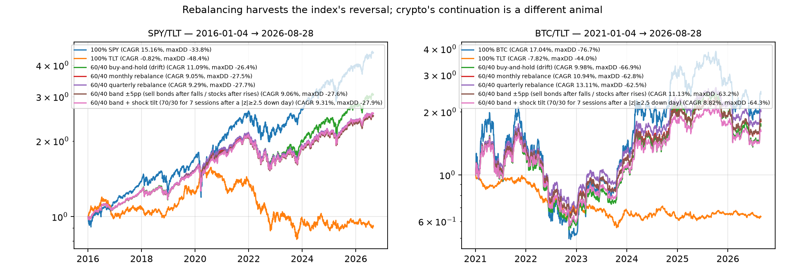

## Conflict of interest and disclosure

The authors operate the signal.dotori.ai service whose forecasts are evaluated here. The study was designed after the 2026-08-19 event; all rules were fixed before scoring (Section 3.6); no change was made to the deployed model during the study; and the code, data manifest (`research/DATA_DEPOSIT.md`) and outputs are released so that the evaluation can be repeated by third parties.
